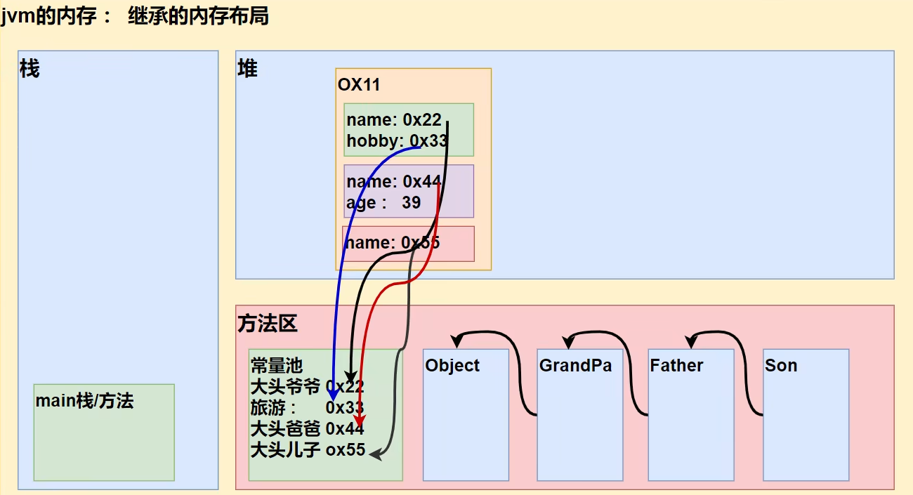

# 类与对象（中级）

## idea 常用快捷键

- ctrl + Y：delete Line

- ctrl + D：copy line

- alt+ /：补全代码

- alt + enter：自动导入类

- ctrl + alt+ L：格式化代码

- ctrl + shift+ F10：快速运行

- 生成构造器等：alt + insert

- 查看类的继承关系：ctrl + h

- 查看方法的实现：ctrl + b

- 自动分配变量名：.var + 回车

使用 idea 模板提升代码效率，查看模板：`file->Settings->Editor->Live Templates->java`

## java 包

包的本质实际上就是创建不同的文件夹来保存类文件，画出示意图

包基本语法：`package.com.hspedu;`

- package 关键字表示打包

- com.hspedu 表示包名

### 命名规则

只能包含数字、字母、下划线、小圆点，但不能用数字开头，不能是关键字或保留字

- demo.class.exec1 不能用关键字

- demo.12a 不能以数字开头

- demo.ab12.oa 正确

### 命名规范

一般是小写字母+小圆点：`com.公司名.项目名.业务模块名`

比如：`com.sina.crm.user //用户模块`，`com.sina.crm.order //订单模块`，`com.sina.crm.utils //工具类`

### 常用的包

一个包下，包含很多的类，java中常用的包有：

`java.lang.* //lang包是基本包 默认引入 不需要再引入`

`java.util.* //util包 系统提供的工具包 工具类 使用Scanner`

`java.net.* //网络包 网络开发`

`java.awt.* //是做java的界面开发 GUI`

### 如何导入包

基本语法：`import pkg` 

比如：`import java.util.Scanner;` 就只是引入一个类 Scanner，`import java.util.*;` 表示将 java.util 包所有类都引入

### 注意事项和使用细节

- package 的作用是声明当前类所在的包，需要放在 class 的最上面，一个类中最多只有一句package

- import 指令位置放在 package 的下面，在类定义前面，可以有多句且没有顺序要求

## 访问修饰符

### 基本介绍

java 提供四种访问控制修饰符号，用于控制方法和属性（成员变量）的访问权限（范围）：

1. 公开级别：用 public 修饰，对外公开

2. 受保护级别：用 protected 修饰，对子类和同一个包中的类公开

3. 默认级别：没有修饰符号，向同一个包的类公开

4. 私有级别：用 private 修饰，只有类本身可以访问，不对外公开

| 访问级别 | 访问修饰符     | 本类  | 同包  | 子类       | 不同包 |
|:----:|:---------:|:---:|:---:|:--------:|:---:|
| 公开   | public    | √   | √   | √        | √   |
| 保护   | protected | √   | √   | √        | ×   |
| 默认   | 无         | √   | √   | ×(子类不同包) | ×   |
| 私有   | private   | √   | ×   | ×        | ×   |

> 具体可以查看此博客 [Java 默认修饰符](https://blog.csdn.net/cocojiji5/article/details/6638240)

### 使用的注意事项

- 修饰符可以用来修饰类中的属性，成员方法以及类

- 只有默认的和 public 才能修饰类，并且遵循上述访问权限的特点

- 因为没有学习继承，因此关于在子类中的访问权限，我们讲完子类后，在回
  头讲解

- 成员方法的访问规则和属性完全一样

## 封装

封装（encapsulation）就是把抽象出的数据（属性）和对数据的操作（方法）封装在一起，数据被保护在内部，程序的其它部分只有通过被授权的操作（方法），才能对数据进行操作。

### 封装的实现步骤（三步）

1. 将属性进行私有化 private（不能直接修改属性）

2. 提供一个公共的（public）set 方法，用于对属性判断并赋值

```java
public void setXxx(类型 参数名) // Xxx 表示某个属性
    // 加入数据验证的业务逻辑
    属性 = 参数名;
}
```

3. 提供一个公共的（public）get 方法，用于获取属性的值

```java
public 类型 getXxx() { // 权限判断
    return 属性 ;
}
```

## 继承

继承可以解决代码复用，让我们的编程更加靠近人类思维。多个类存在相同的属性（变量）和方法时，可以从这些类中抽象出父类，在父类中定义这些相同的属性和方法，所有的子类不需要重新定义这些属性和方法，只需要通过 `extends` 来声明继承父类即可

### 继承的基本语法

```java
class 子类 extends 父类 {
}
```

- 子类就会自动拥有父类定义的属性和方法

- 父类又叫超类，基类

- 子类又叫派生类

```java
public class Student {
    public String name;
    public int age;
    private double score;

    public void setScore(double score) {
        this.score = score;
    }
    public void showInfo() {
        System.out.println("Student name: " + this.name + " Age: " + this.name + " score: " + this.score);
    }
}

public class Graduate extends Student {
    public void testing() {
        System.out.println("大学生 " + name + " 正在考大学数学");
    }
}
```

### 继承细节

1. 子类继承了所有的属性和方法，但是私有属性不能在子类直接访问，要通过公共的方法去访问

2. 子类必须调用父类的构造器,完成父类的初始化

3. 当创建子类对象时，不管使用子类的哪个构造器，默认情况下总会去调用父类的无参构造器，如果父类没有提供无参构造器，则必须在子类的构造器中用 `super()` 去指定使用父类的哪个构造器完成对父类的初始化工作，否则，编译不会通过（举例说明）

4. 如果希望指定去调用父类的某个构造器，则显式的调用一下: `super(参数列表)`

5. `super` 在使用时，需要放在构造器第一行

6. `super()` 和 `this()` 都只能放在构造器第一行，因此这两个方法不能共存在一个构造器

7. java 所有类都是 Object 类的子类，Object 类是其他所有类的基类

8. 父类构造器的调用不限于直接父类！将一直往上追溯直到 Object 类（顶级父类）

9. 子类最多只能继承一个父类（指直接继承），即 java 中是单继承机制。思考：如何让 A 类继承 B 类和 C 类？答案：`A->B->C`

10. 不能滥用继承，子类和父类之间必须满足 is-a 的逻辑关系：Cat is a Animal

### 继承本质分析

> 当子类对象创建好之后，建立查找的关系

```java
Son son = new Son();

class GrandPa {
    String name = "牛爷爷";
    String hobby = "旅游";
}
class Father extends GrandPa {
    String name = "小头爸爸";
    int age = 39;
}
class Son extends Father {
    String name = "大头儿子";
}
```

**内存图**

<div align="center">

</div>

**查找关系**

- 首先看子类是否有该属性，如果子类有这个属性，并且可以访问，则返回信息

- 如果子类没有这个属性，就看父类有没有这个属性（如果父类有该属性，并且可以访问，就返回信息）

- 如果父类没有就按照这个规则，继续找上级父类，直到 object 类

## super 关键字

super 代表父类的引用，用于访问父类的属性、方法、构造器

### 基本语法

- 访问父类的属性，但不能访问父类的 `private` 属性，`super.属性名`

- 访问父类的方法，不能访问父类的 private 方法，`super.方法名(参数列表)`

- 访问父类的构造器（这点前面用过）：`super(参数列表)`，只能放在构造器的第一句，只能出现一句!

### super 关键字优点

- 调用父类的构造器的好处（分工明确，父类属性由父类初始化，子类的属性由子类初始化）

- 当子类中有和父类中的成员（属性和方法）重名时，为了访问父类的成员，必须通过`super`。如果没有重名，使用 `super`、`this` 直接访问是一样的效果

### 使用细节

1. 细节1

```java
// 3种调用方法
cal();  // 在本类中寻找方法，找不到再去父类中找
this.cal();  // 等于cal()
super.cal();  // 跳过本类，直接找父类的cal()
/*对于类属性也是一样的*/
```

2. `super` 的访问不限于直接父类，如果爷爷类和本类中有同名的成员，也可以使用 `super` 去访问爷爷类的成员；如果多个基类中都有同名的成员，使用 `super` 访问遵循就近原则。`A->B->C`，当然也要遵守访问规则

### super 和 this 关键字比较

| 区别点   | this                        | super                |
|:-----:|:--------------------------- |:-------------------- |
| 访问属性  | 访问本类中的属性，如果本类没有此属性则从父类中继续查找 | 访问父类中的属性             |
| 调用方法  | 访问本类中的方法,如果本类没有此方法则从父类继续查找. | 直接访问父类中的方法           |
| 调用构造器 | 调用本类构造器，必须放在构造器的首行          | 调用父类构造器，必须放在子类构造器的首行 |
| 特殊    | 表示当前对象                      | 中访问父类对象              |

## 方法重写 override

简单的说：方法覆盖（重写）就是子类有一个方法，和父类的某个方法的名称、返回类型、参数一样，那么我们就说子类的这个方法覆盖了父类的方法

### 注意事项和使用细节

- 子类的方法的参数、方法名称，要和父类参数、方法名称完全一样。

- 子类方法的返回类型和父类方法返回类型一样，或者是父类返回类型的子类，比如：父类返回类型是 `Object`，子类方法返回类型是 `String`

- 子类方法不能缩小父类方法的访问权限，public > protected >默认>private
