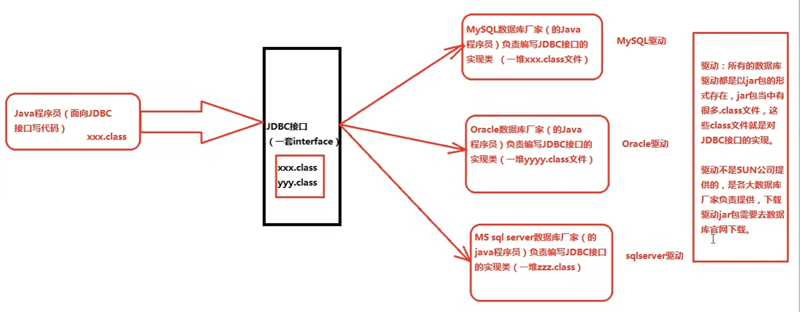

# JDBC

Java DataBase Connectivity（Java语言连接数据库）

JDBC 的本质是什么？
- JDBC 是 SUN 公司制定的一套接口（interface）
- 在 `java.sql` 包中

接口都有调用者和实现者。面向接口调用、面向接口写实现类，这都属于面向接口编程。为什么要面向接口编程？
- 解耦合：降低程序的耦合度，提高程序的扩展力。多态机制就是非常典型的：面向抽象编程

思考：为什么 SUN 制定一套 JDBC 接口呢？
- 因为每一个数据库的底层实现原理都不一样。Oracle 数据库有自己的原理，MySQL 数据库也有自己的原理，MS Sql server 数据库也有自己的原理。每一个数据库产品都有自已独特的实现原理

接口和实现类关系示意

