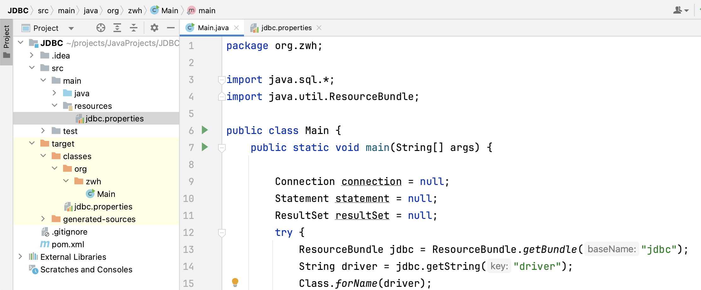

# 使用资源绑定器配置数据库

就是把数据库相关数据放到了 jdbc.properties 文件中

在 maven 项目中，可以把配置文件放到 resources 文件夹中，在 maven 项目运行时，会把这个文件移动到 target/class 文件夹中，这样 Main 类就可以看到这个文件了



`jdbc.properties` 文件内容

```
driver = com.mysql.cj.jdbc.Driver
url = jdbc:mysql://localhost:3306/sql_store
user = root
password = 123456
```


