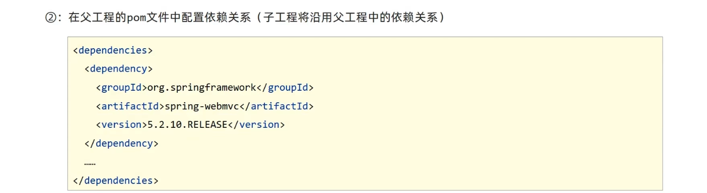

# 继承与聚合

## 聚合

步骤

## 继承

概念：继承描述的是两个工程间的关系，与 java 中的继承相似，子工程可以继承父工程中的配置信息，常见于依赖关系的继承打

作用：
- 简化配置
- 减少版本冲突

## 聚合与继承的区别

作用
- 聚合用于快速构建项目
- 继承用于快速配置

相同点
- 聚合与继承的 pom.xml 文件打包方式均为pom，可以将两种关系制作到同一个 pom 文件中
- 聚合与继承均属于设计型模块，并无实际的模块内容

不同点
- 聚合是在当前模块中配置关系，聚合可以感知到参与聚合的模块有哪些
- 继承是在子模块中配置关系，父模块无法感知哪些子模块继承了自己

