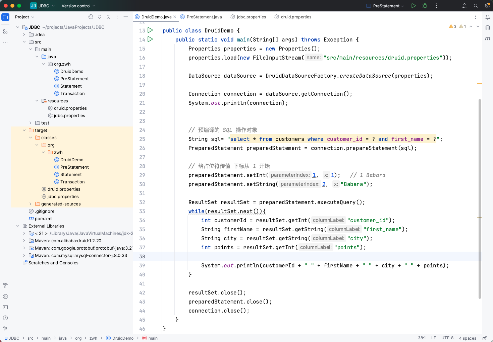
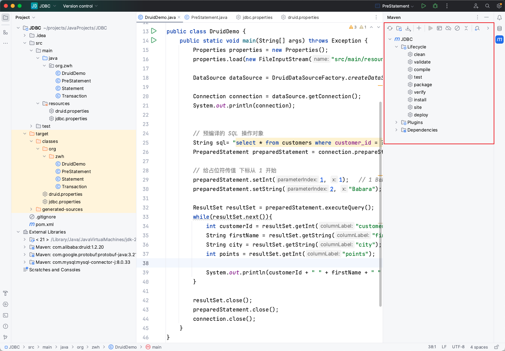
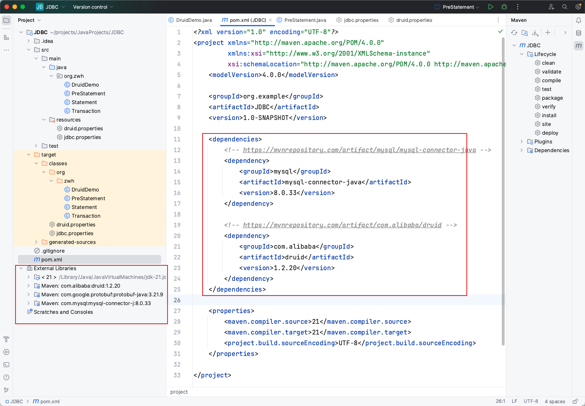
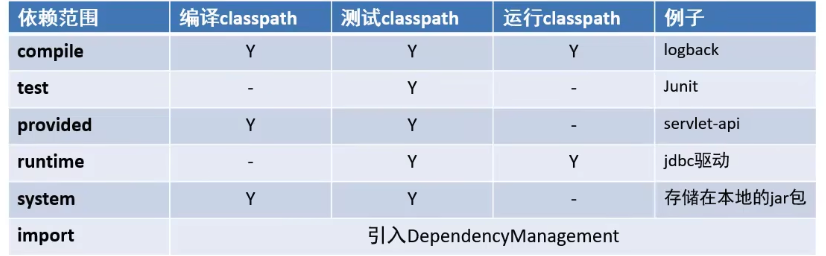

# Maven

Maven 是专门用于管理和构建 Java 项目的工具，它的主要功能有
- 提供了一套标准化的项目结构
- 提供了一套标准化的构建流程 (编译，测试，打包，发布......)
- 提供了一套依赖管理机制

## 目录结构



其中：
- src 放源代码
    - main 放源代码
        - java 源码
        - resources 放置资源文件
    - test 测试代码
- pom.xml 项目核心配置文件：可以借助 pom 文件导入 maven 项目

## 构建流程

通过按钮实现：编译、测试、打包、发布



## 依赖管理

- Maven 使用标准的坐标配置来管理各种依赖
- 只需要简单的配置就可以完成依赖管理



## 常用命令

- compile 编译
- clean 清理
- test 测试
- package 打包
- install 安装：将项目本身编译并打包到本地仓库

## 坐标

什么是坐标?
- Maven 中的坐标是资源的唯一标识
- 使用坐标来定义项目或引入项目中需要的依赖 

Maven 坐标主要组成
- groupId：定义当前 Maven 项目隶属组织名称（通常是域名反写，例如：com.itheima）
- artifactId：定义当前 Maven 项目名称（通常是模块名称，例如：order-service、goods-service）
- version：定义当前项目版本号

## 依赖范围

通过设置坐标的依赖范围（scope），可以设置对应 jar 包的作用范围：编译环境、测试环境、运行环境



默认值：compile，大部分场景使用默认就行

```xml
<dependency>
    <groupId>mysql</groupId>
    <artifactId>mysql-connector-java</artifactId>
    <version>8.0.33</version>
    <scope>compile</scope>
</dependency>
```


