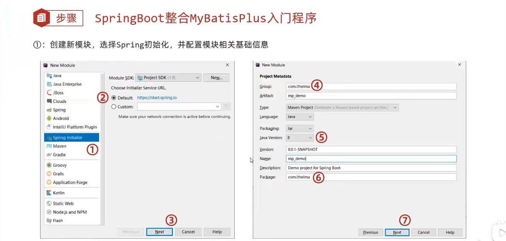

# 简介

MyBatisPlus（简称 MP）是基于 MyBatis 框架基础上开发的增强型工具，旨在简化开发、提高效率

开发方式
- 基于 MyBatis 使用 MyBatisPlus 
- 基于 Spring 使用 MyBatisPlus
- 基于 SpringBoot 使用 MyBatisPlus

MyBatisPlus 特性
- 无侵入：只做增强不做改变，不会对现有工程产生影响
- 强大的 CRUD 操作：内置通用 Mapper，少量配置即可实现单表 CRUD 操作
- 支持 Lambda：编写查询条件无需担心字段写错
- 支持主键自动生成
- 内置分页插件

## 使用步骤

