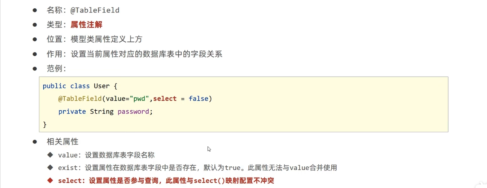

# DQL 编程控制

条件查询

MyBatisPlus 将书写复杂的 SQL 查询条件进行了封装，使用编程的形式完成查询条件的组合

## 设置查询条件

## 组合查询条件

## null 值处理

## 查询投影

## 查询条件设置

具体查看文档

## 字段映射与表名映射

问题：
- 表字段与编码属性设计不同步
- 编码中添加了数据库中未定义的属性
- 采用默认查询开放了更多的字段查看权限
- 表名与编码开发设计不同步

