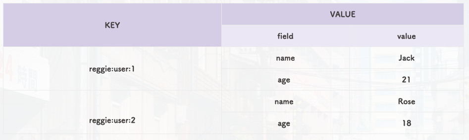

# Hash 类型

Hash 类型，也叫散列，其中 value 是一个无序字典，类似于 Java 中的 HashMap 结构

String 结构是将对象序列化为 JSON 字符串后存储，当我们要修改对象的某个属性值的时候很不方便，如：

| KEY             | VALUE                                   |
|-----------------|-----------------------------------------|
| reggie:user:1   | {"id":1, "name": "Jack", "age": 21}     |
| reggie:dish:1   | {"id":1, "name": "鲟鱼火锅", "price": 4999} |

Hash 结构可以将对象中的每个字段独立存储，可以针对单个字段做 CRUD

## Hash的常用命令

| 命令       | 描述                                                        |
|------------|-------------------------------------------------------------|
| HSET key field value | 添加或者修改 hash 类型 key 的 field 的值                        |
| HGET key field       | 获取一个 hash 类型 key 的 field 的值                             |
| HMSET                | 批量添加多个 hash 类型 key 的 field 的值                         |
| HMGET                | 批量获取多个 hash 类型 key 的 field 的值                         |
| HGETALL              | 获取一个 hash 类型的 key 中的所有的 field 和 value                |
| HKEYS                | 获取一个 hash 类型的 key 中的所有的 field                       |
| HINCRBY              | 让一个 hash 类型 key 的字段值自增并指定步长                    |
| HSETNX               | 添加一个 hash 类型的 key 的 field 值，前提是这个 field 不存在，否则不执行 |

