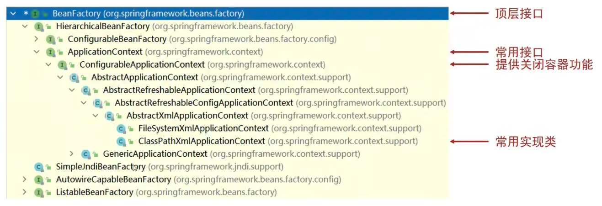
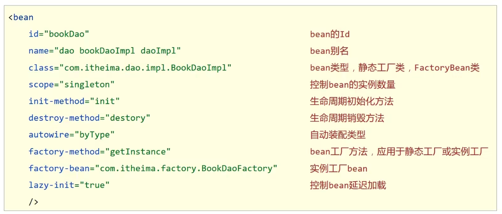
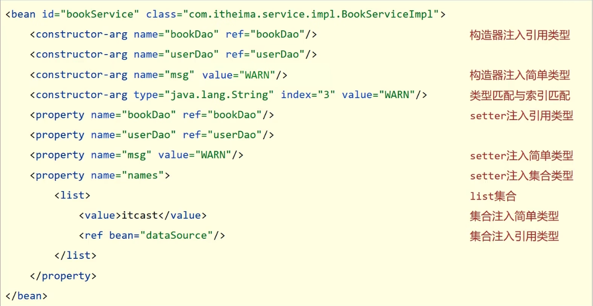

# 容器

## 创建容器

方式一：类路径加载配置文件 **主要方式**

```java
ApplicationContext ctx = new ClassPathXmlApplicationContext("applicationContext.xml");
```

方式二：文件路径加载配置文件

```java
ApplicationContext ctx = new FileSystemXmlApplicationContext("/Users/zhaowenhao/projects/JavaProjects/spring_09_datasource/src/main/resources/applicationContext.xml");
```

加载多个配置文件

```java
ApplicationContext ctx = new ClassPathXmlApplicationContext("bean1.xml", "bean2.xml");
```

## 获取 bean

方式一：使用 bean 名称获取

```java
BookDao bookDao = (BookDao) ctx.getBean("bookDao");
```

方式二：使用 bean 名称获取并指定类型

```java
BookDao bookDao = ctx.getBean("bookDao", BookDao.class);
```

方式三：使用 bean 类型获取

```java
BookDao bookDao = ctx.getBean(BookDao.class);
```

## 容器的类层次结构



## BeanFactory 初始化

> 了解即可

类路径加载配置文件

```java
Resource resources = new ClassPathResource("applicationContext.xml");
BeanFactory bf = new XmlBeanFactory(resources);
BookDao bookDao = bf.getBean("bookDao", BookDao.class);
bookDao.save(),
```

BeanFactory 创建完毕后，所有的 bean 均为延迟加载

# 核心容器总结

## 容器相关
- BeanFactory 是 IoC 容器的顶层接口，初始化 BeanFactory 对象时，加载的 bean 延迟加载
- ApplicationContext 接口是 Spring 容器的核心接口，初始化时 bean 立即加载
- ApplicationContext 接口提供基础的 bean 操作相关方法，通过其他接口扩展其功能
- ApplicationContext 接口常用初始化类
    - ClassPathXmlApplicationContext
    - FileSystemXmlApplicationContext

## bean 相关



## 依赖注入相关




