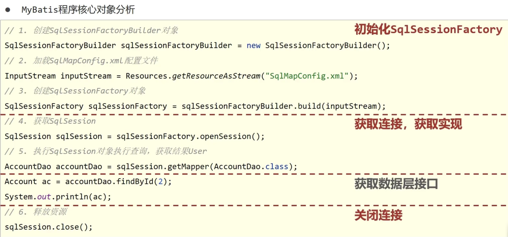
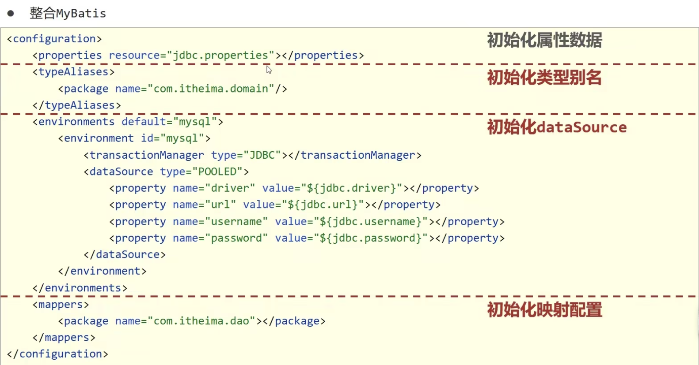
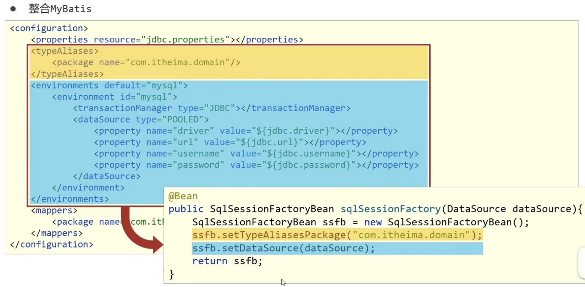
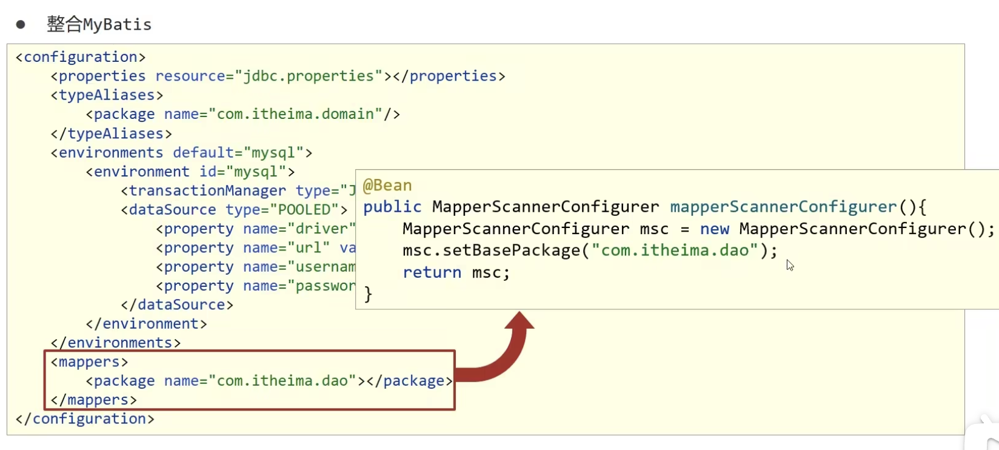

# Spring 整合 Mybatis

新增 pom 依赖坐标

```xml
<dependencies>
    <!-- https://mvnrepository.com/artifact/org.springframework/spring-jdbc -->
    <dependency> <!-- spring 操作数据库 -->
        <groupId>org.springframework</groupId>
        <artifactId>spring-jdbc</artifactId>
        <version>6.1.1</version>
    </dependency>

    <!-- https://mvnrepository.com/artifact/org.mybatis/mybatis-spring -->
    <dependency> <!-- spring 整合 mybatis -->
        <groupId>org.mybatis</groupId>
        <artifactId>mybatis-spring</artifactId>
        <version>3.0.3</version>
    </dependency>
</dependencies>
```



MyBatis 的核心是 SqlSessionFactory 对象， Spring 需要管理 SqlSessionFactory 这个 bean



SqlSessionFactory 这个 bean 需要配置**映射返回值**和**数据库配置信息**

**初始化映射配置**需要定义为单独的一个 bean






