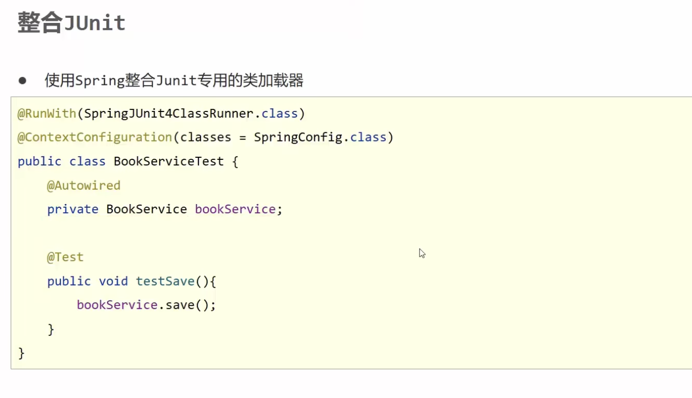

# Spring 整合 JUnit

新增 pom 依赖坐标

```xml
<dependencies>
    <dependency>
        <groupId>junit</groupId>
        <artifactId>junit</artifactId>
        <version>4.13.1</version>
        <scope>test</scope>
    </dependency>

    <!-- https://mvnrepository.com/artifact/org.springframework/spring-test -->
    <dependency> <!-- spring junit -->
        <groupId>org.springframework</groupId>
        <artifactId>spring-test</artifactId>
        <version>6.0.14</version>
        <scope>test</scope>
    </dependency>
</dependencies>
```




