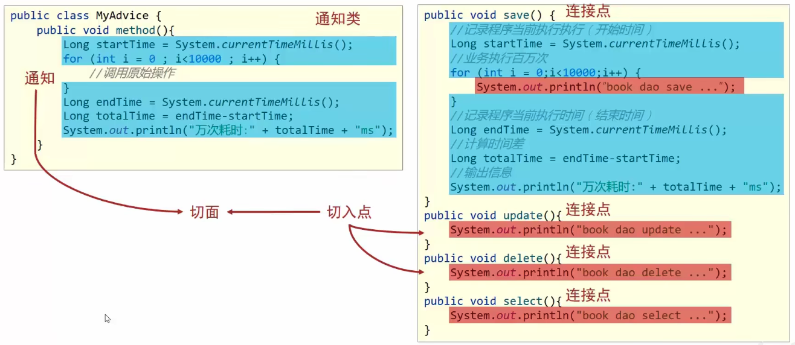

# AOP 简介

AOP（Aspect Oriented Programming）面向切面编程，一种编程范式，指导开发者如何组织程序结构

00P（Object Oriented Programming）面向对象编程

作用：在不惊动原始设计的基础上为其进行功能增强

Spring 理念：无入侵式/无侵入式

## AOP 核心概念

连接点（JoinPoint）：程序执行过程中的任意位置，粒度为执行方法、抛出异常、设置变量等
- 在 SpringAOP 中，理解为方法的执行

切入点（Pointcut）：匹配连接点的式子在 SpringAOP 中，一个切入点可以只描述一个具体方法，也可以匹配多个方法 - 一个具体方法：com.itheima.dao 包下的 BookDao 接口中的无形参无返回值的 save 方法 
- 匹配多个方法：所有的 save 方法，所有的 get 开头的方法，所有以 Dao 结尾的接口中的任意方法，所有带有一个参数的方法

通知（Advice）：在切入点处执行的操作，也就是共性功能
- 在 SpringA0P 中，功能最终以方法的形式呈现

通知类：定义通知的类

切面（Aspect）：描述通知与切入点的对应关系

