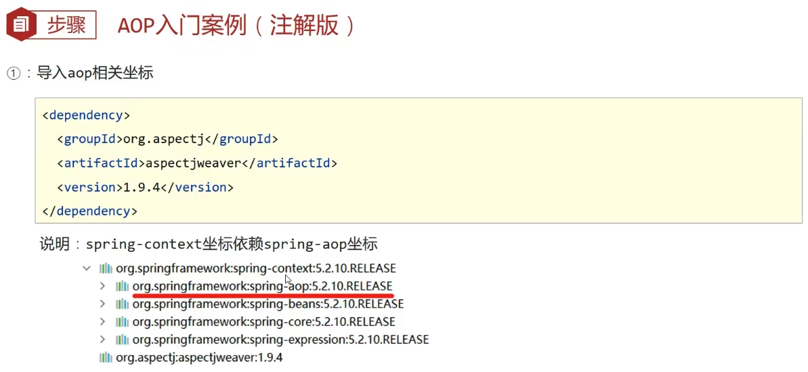
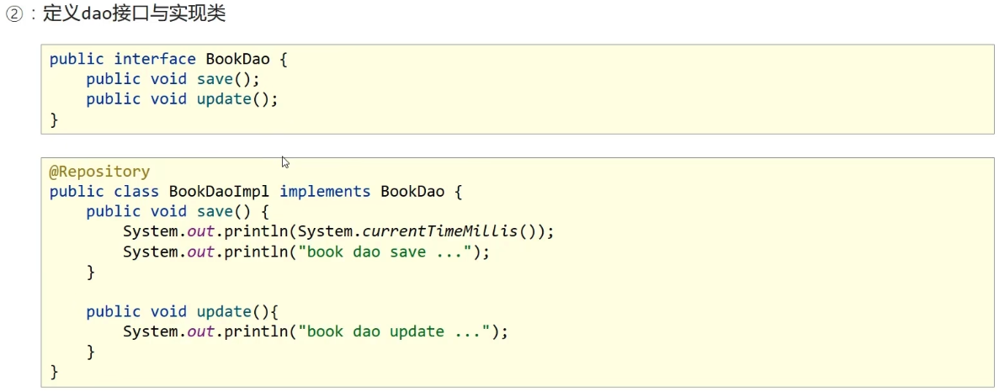
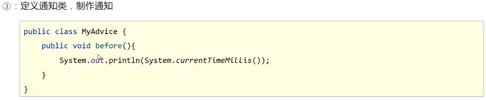
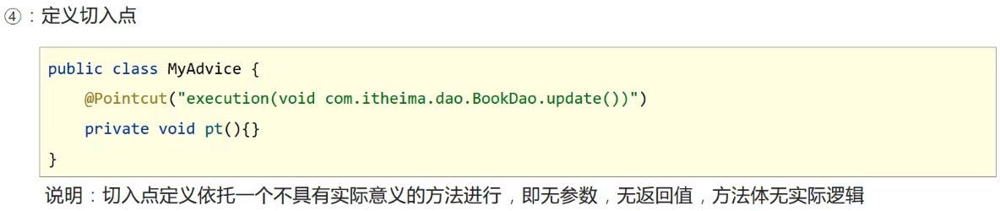
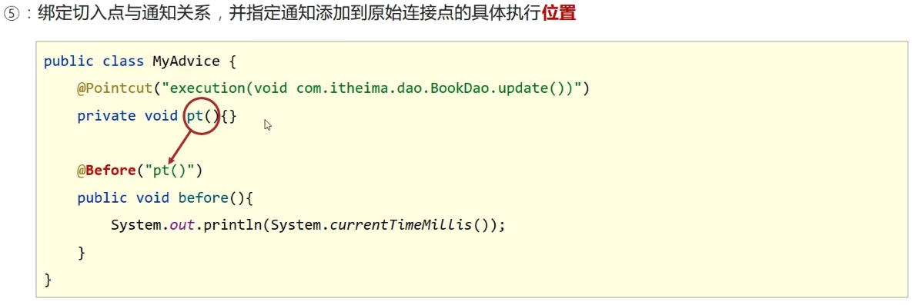
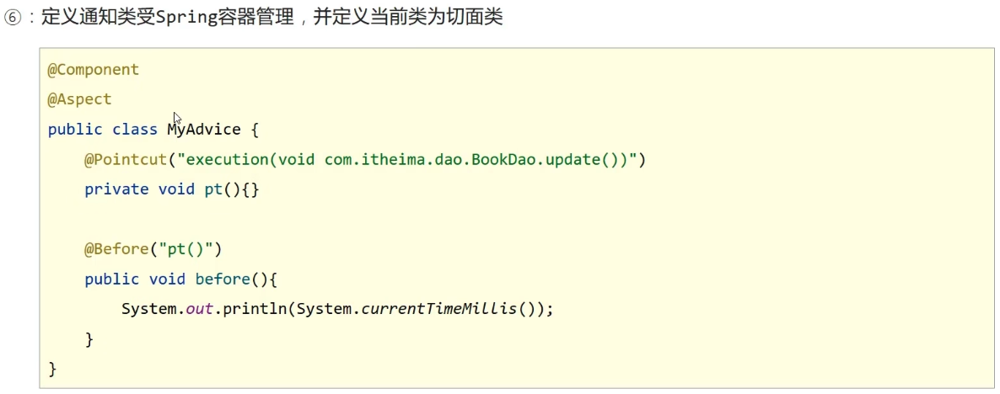
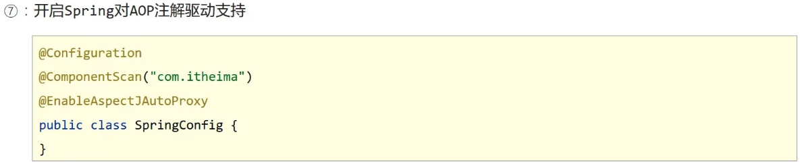

# AOP 入门案例

## AOP 入门案例思路分析

- 案例设定：测定接口执行效率
- 简化设定：在接口执行前输出当前系统时间
- 开发模式：XML or 注解
- 思路分析：
    1. 导入坐标（pom.xml）
    2. 制作连接点方法（原始操作，Dao 接口与实现类）
    3. 制作共性功能（通知类与通知）
    4. 定义切入点
    5. 绑定切入点与通知关系（切面）

