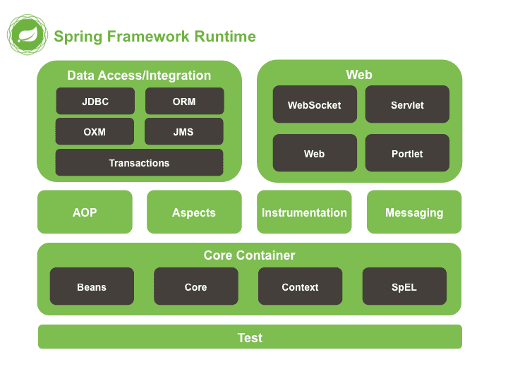

# 初识 Spring

Spring Framework 系统架构图

Spring Framework 是 Spring 生态圈中最基础的项目，是其他项目的根基

- Test：单元测试与集成测试
- Core Container：核心容器
- AOP：面向切面编程
- Aspects：AOP 思想实现
- Data Access：数据访问
- Data Integration：数据集成
- Web：Web 开发

Spring Framework 课程学习路线

