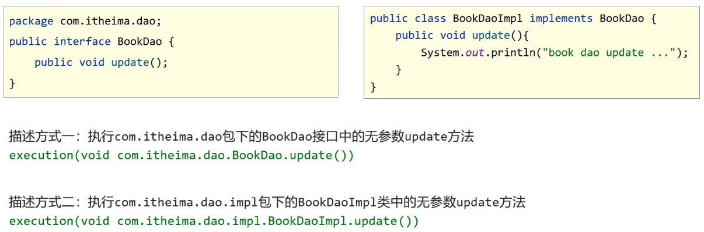
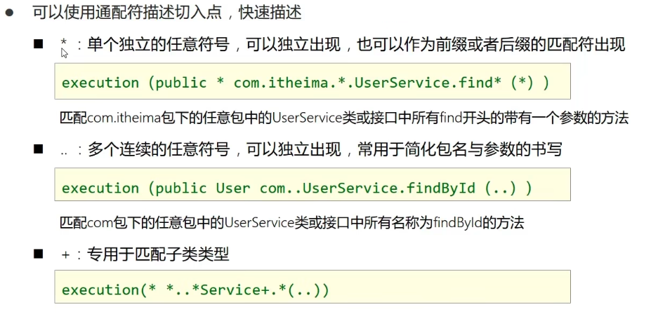

# AOP 切入点表达式

## AOP 切入点表达式

切入点：要进行增强的方法

切入点表达式：要进行增强的方法的描述方式



切入点表达式标准格式：`动作关键字(访问修饰符 返回值 包名.类/接口名.方法名(参数)异常名)`

```java
execution (public User com.itheima.service.UserService.findById(int))
```

- 访问修饰符可以省略
- 异常名可以省略

## 使用通配符



## 书写技巧

- 所有代码按照标准规范开发，否则以下技巧全部失效
- 描述切入点通常描述接口，而不描述实现类
- 访问控制修饰符针对接口开发均采用 public 描述（可省略访问控制修饰符描述）
- 返回值类型对于增删改类使用精准类型加速匹配，对于查询类使用 `*` 通配快速描述
- 包名书写尽量不使用 `..` 匹配，效率过， 常用 `*`做单个包描述匹配，或精准匹配
- 接口名/类名书写名称与模块相关的采用 `*` 匹配，例如 UserService 书写成 `*Service`，绑定业务层接口名
- 方法名书写以动词进行精准匹配，名词采用 `*` 匹配，例如 `getById` 书写成 `getBy*`，`selectAll` 书写成 `selectAll` 
- 参数规则较为复杂，根据业务方法灵活调整
- 通常不使用异常作为匹配规则


