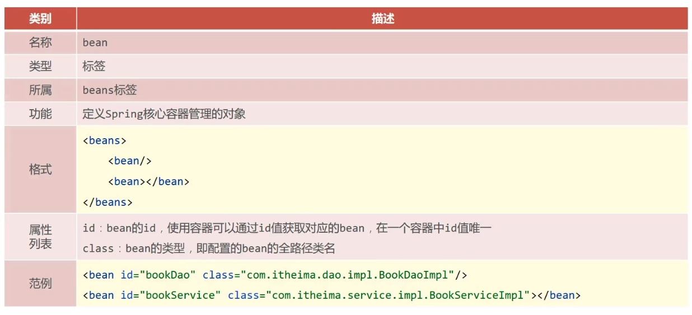
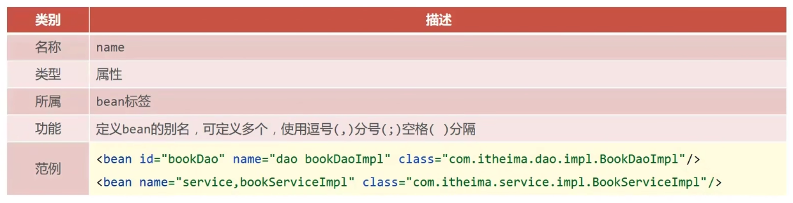
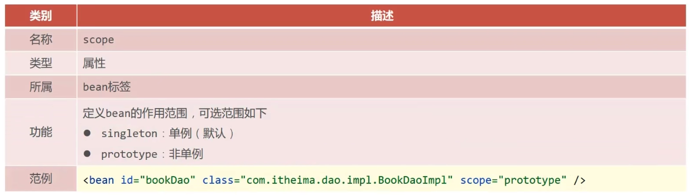

# bean 的配置

## 基础配置

## bean 的别名

### 注意事项

获取 bean 无论是通过 id 还是 name 获取，如果无法获取到，将抛出异常`NoSuchBeanDefinitionExceptionNoSuchBeanDefinitionException: No bean named 'xxx' available`

## bean 的作用范围

### bean 作用范围说明

为什么 bean 默认为单例？

适合交给容器进行管理的 bean
- 表现层对象
- 业务层对象
- 数据层对象
- 工具对象

不适合交给容器进行管理的 bean
- 封装实体的域对象

