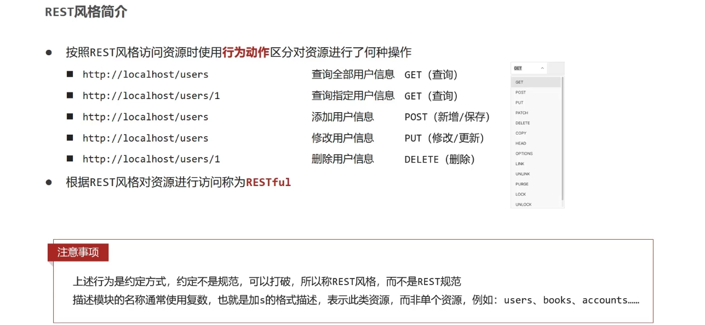

# REST 风格简介

REST（Representational State Transfer），表现形式状态转换

传统风格资源描述形式
- http://localhost/user/getById?id=1
- http://localhost/user/saveUser

REST 风格描述形式
- http://localhost/user/1
- http://localhost/user

优点：
- 隐藏资源的访问行为，无法通过地址得知对资源是何种操作
- 书写简化

