# SSM 整合

## 整合配置、功能模块开发、接口测试

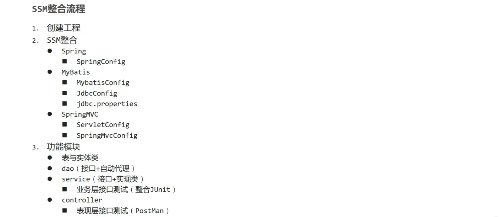

## 表现层与前端数据传输协议定义

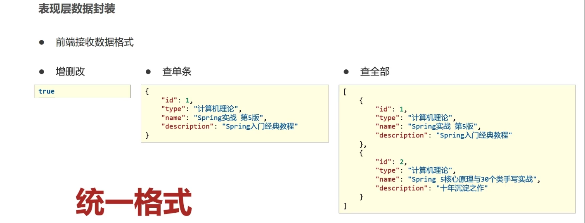

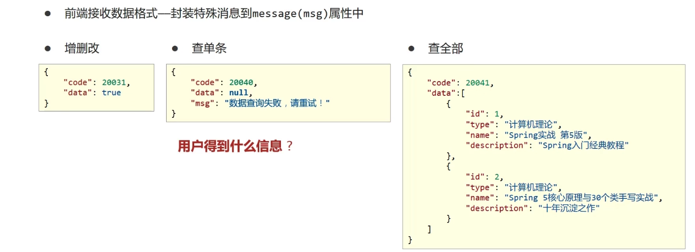

## 设置统一返回结果类

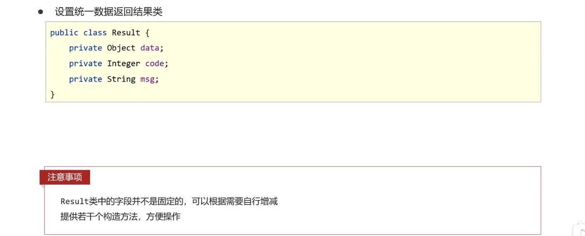

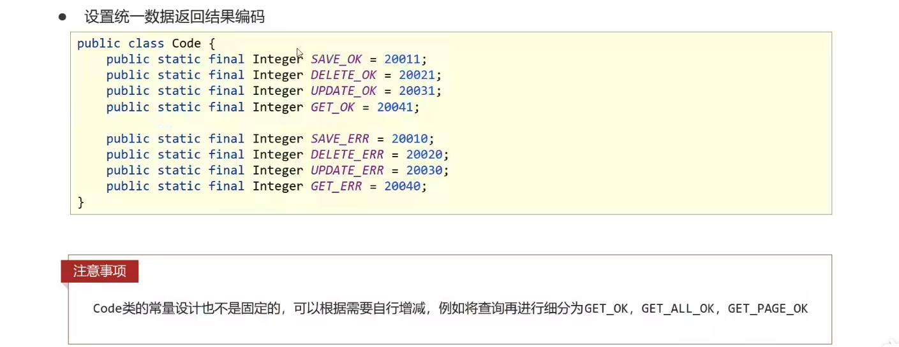

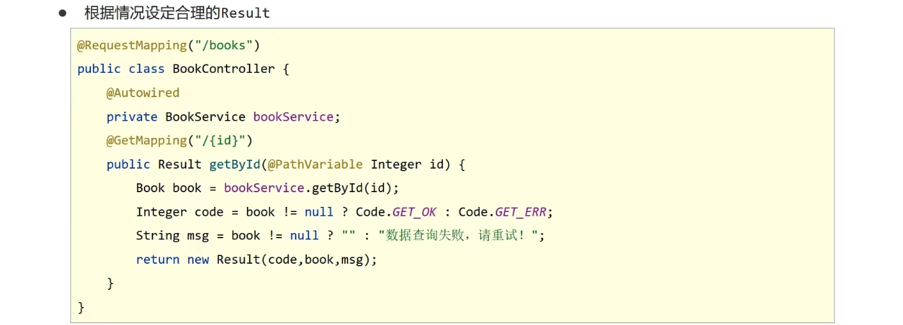

## 异常处理器

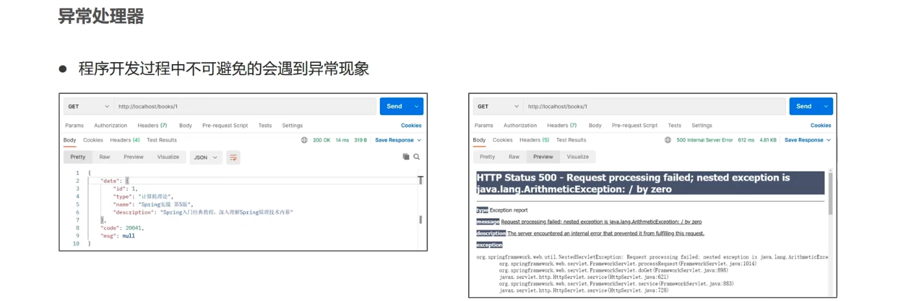

各个层级均出现异常，异常处理代码书写在哪一层
- 所有的异常均抛出到表现层进行处理

表现层处理异常，每个方法中单独书写，代码书写量巨大且意义不强，如何解决
- AOP思想

### 异常处理器

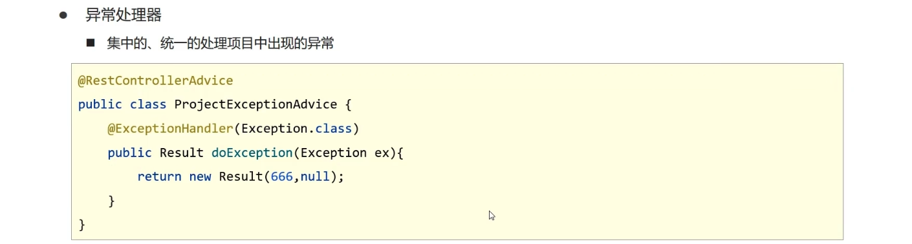

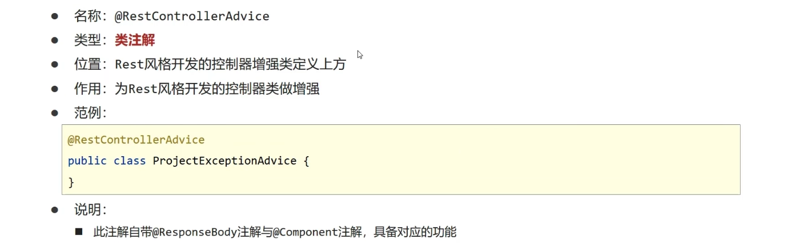

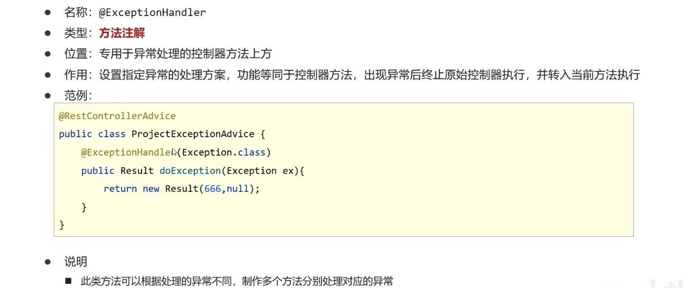

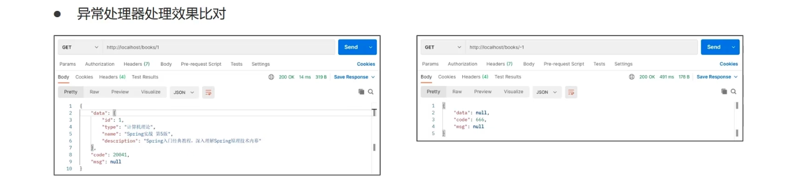

### 项目异常

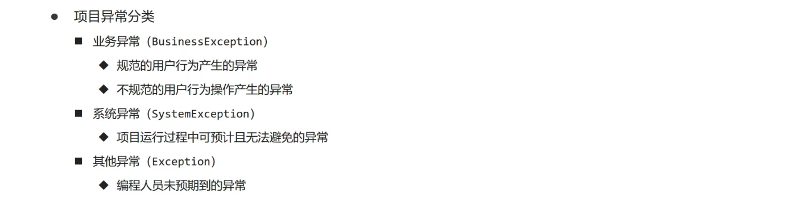

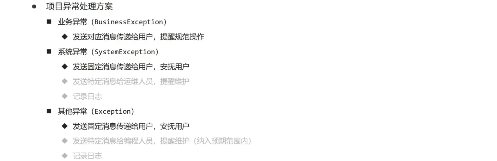

