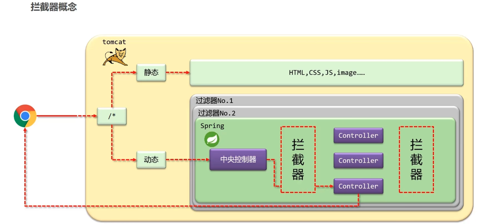

# 拦截器

底层就是 AOP

## 拦截器简介

拦截器（Interceptor）是一种动态拦截方法调用的机制

作用
- 在指定的方法调用前后执行预先设定后的的代码
- 阻止原始方法的执行

拦截器与过滤器区别
- 归属不同：Filter 属于 Servlet 技术，Interceptor 属于 SpringMVC 技术
- 拦截内容不同：Filter 对所有访问进行增强，Interceptor 仅针对 SpringMVC 的访问进行增强

## 入门案例

简化开发

执行流程

## 拦截器参数

## 多拦截器执行顺序

