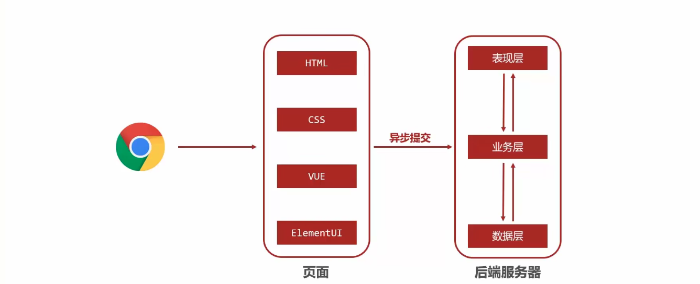
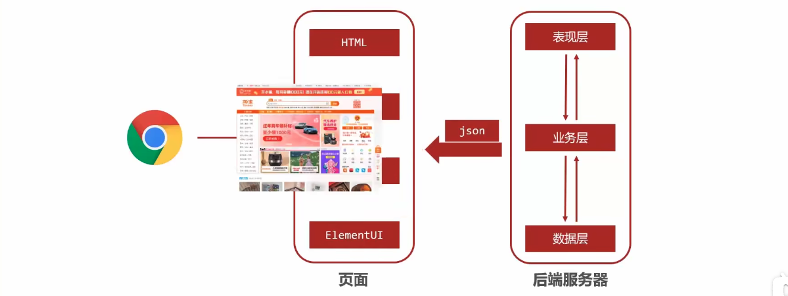
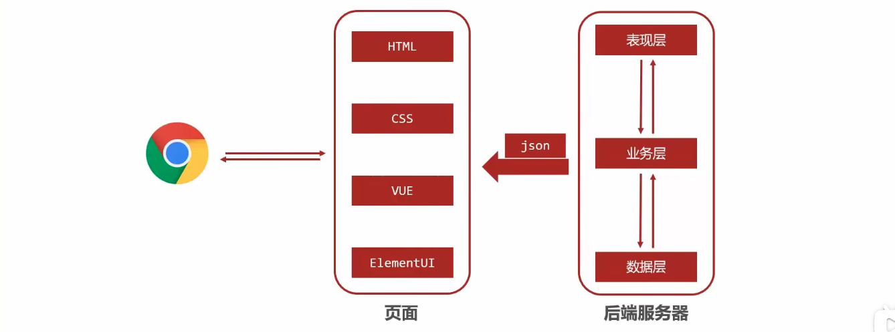
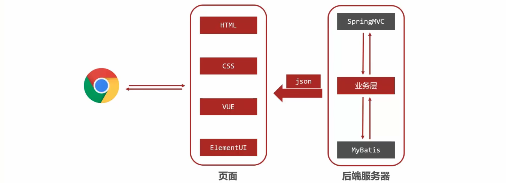

# SpringMVC 简介

## SpringMvC 概述

- SpringMVC 技术与 Servlet 技术功能等同，均属于 web 层开发技术
- SpringMVC 是一种基于 Java 实现 MVC 模型的轻量级 web 框架
- 优点：
    1. 使用简单，开发便捷（相比于 servlet）
    2. 灵活性强

本章目录
- SpringMvC 简介
- 请求与响应
- REST 风格
- SSM 整合拦截器

目标
- 掌握基于 SpringMVC 获取请求参数与响应 json 数据操作
- 熟练应用基于 REST 风格的请求路径设置与参数传递
- 能够根据实际业务建立前后端开发通信协议并进行实现
- 基于 SSM 整合技术开发任意业务模块功能

## web 应用数据处理流程

