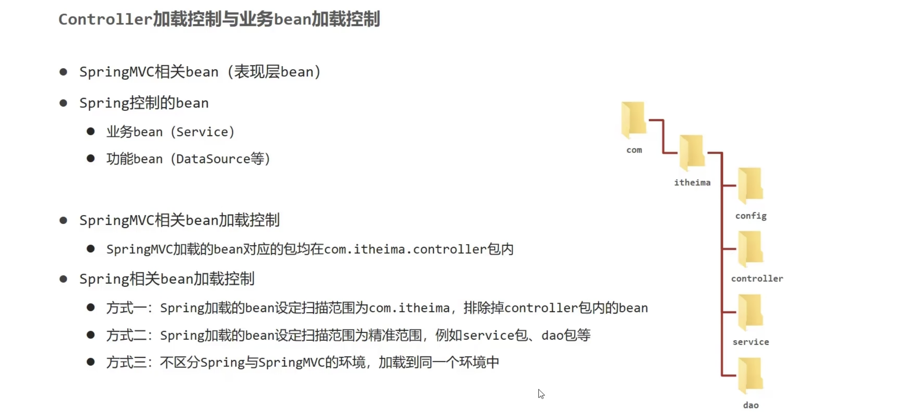
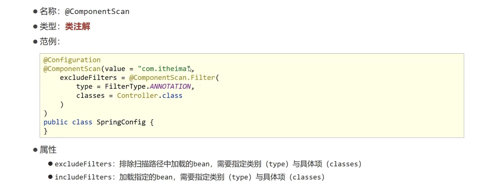
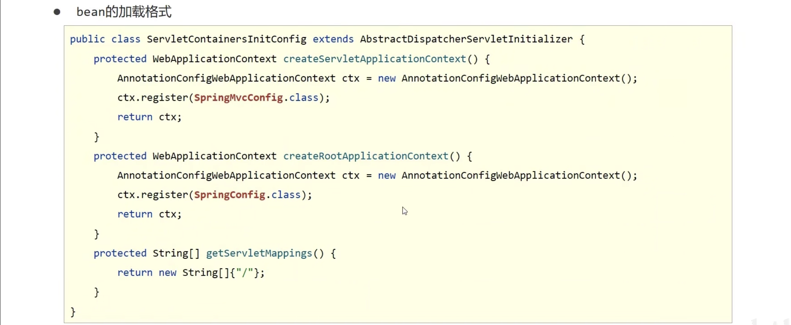
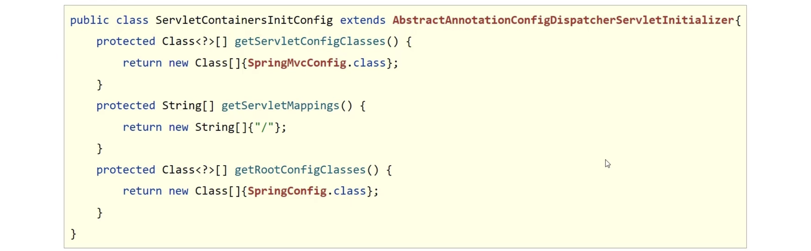

# Bean 加载与控制

## Controller 加载控制与业务 bean 加载控制

因为功能不同，如何避免 Spring 错误的加载到 SpringMVC 的 bean？
- 加载 Spring 控制的 bean 的时候排除掉 SpringMVC 控制的 bean

- 建议采用第一种方法
- 第二种方法在 springboot 中有使用
- 第三种可能偶尔使用

## 方法二

## 目前加载 spring 和 springMVC 的方式

## 简化开发

