# 简介

SpringBoot 是由 Pivotal 团队提供的全新框架，其设计目的是用来简化 Spring 应用的初始搭建以及开发过程

入门案例开发步骤

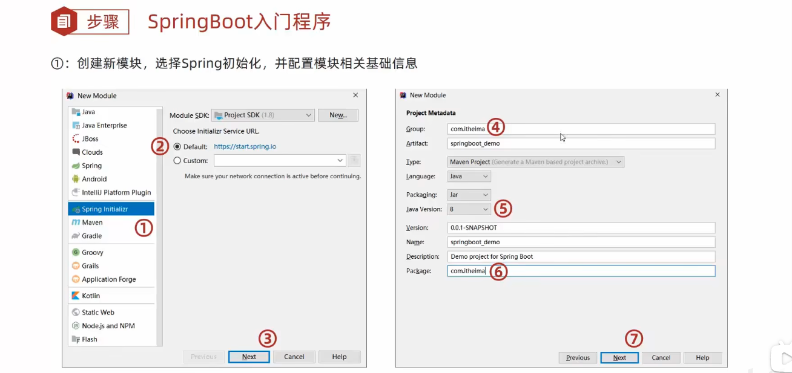

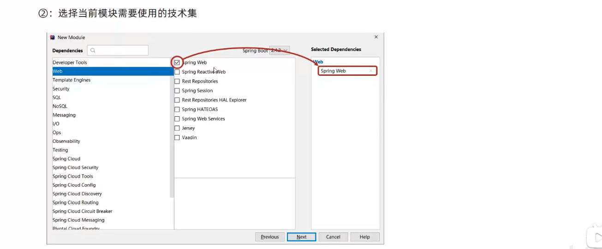

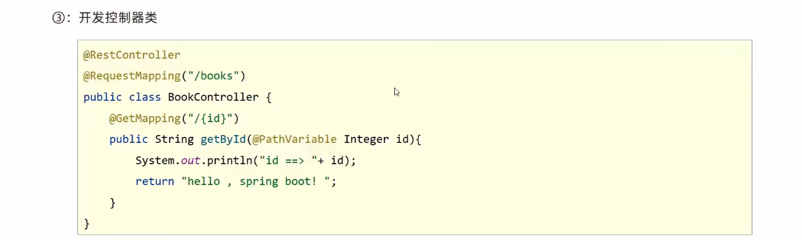

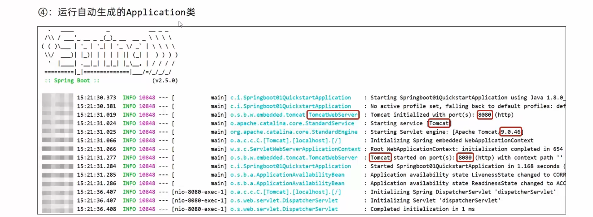

最简 SpringBoot 程序所包含的基础文件
- pom.xml 文件
- Application 类

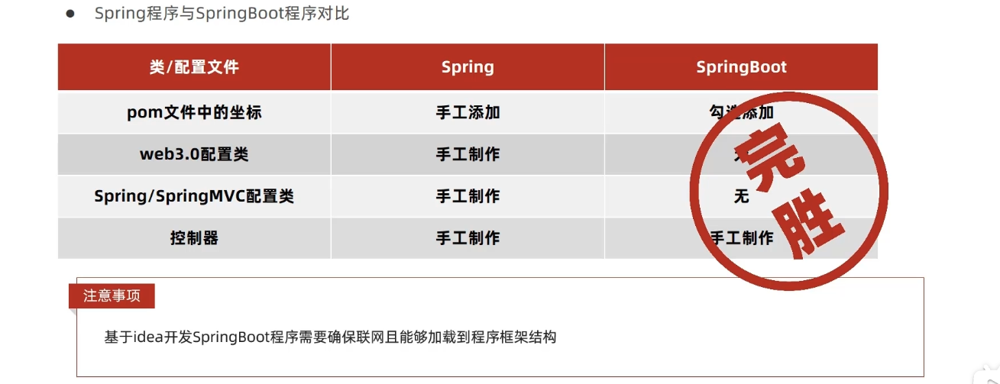

也可以去 boot 官网下载

SpringBoot 项目快速启动

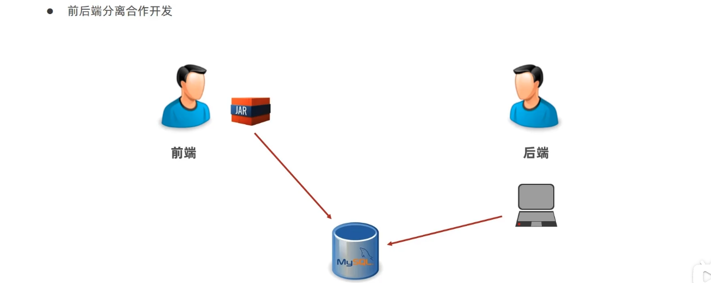

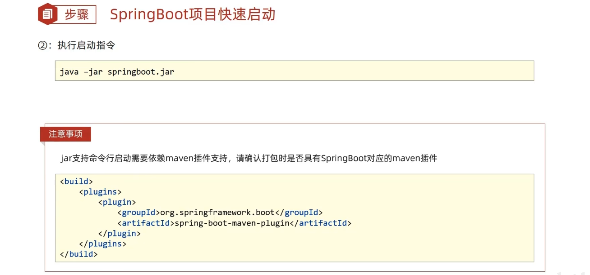

SpringBoot 概述

SpringBoot 是由Pivotal 团队提供的全新框架，其设计目的是用来简化 Spring 应用的初始搭建以及开发过程

Spring 程序缺点
- 配置繁琐
- 依赖设置繁琐

SpringBoot 程序优点
- 自动配置
- 起步依赖（简化依赖配置）
- 辅助功能（内置服务器，......）

起步依赖

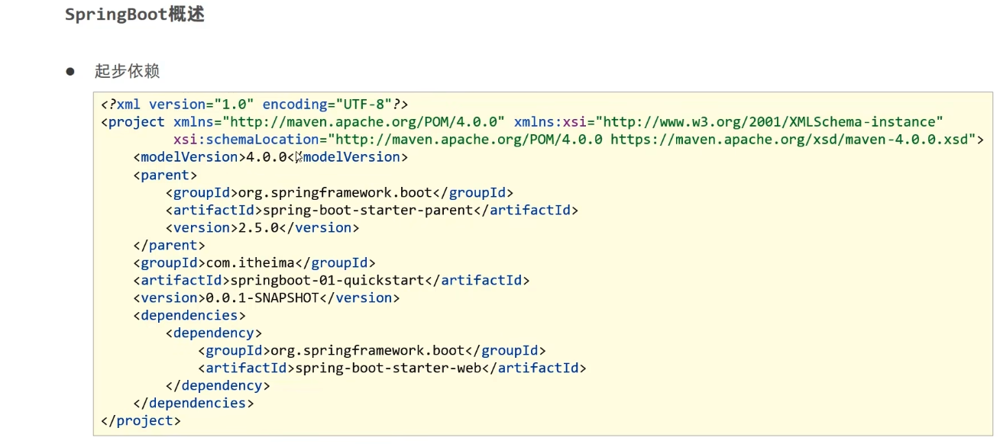

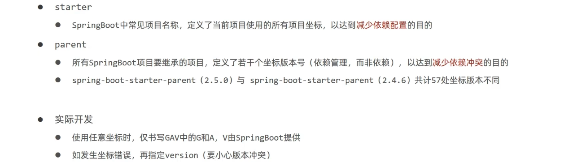

辅助功能

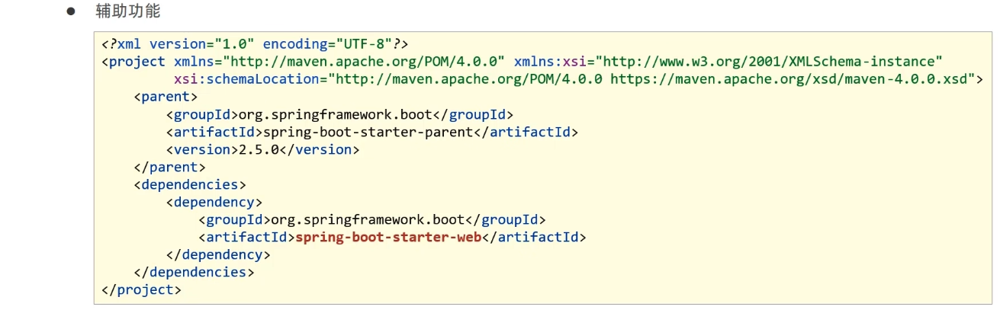

启动方式

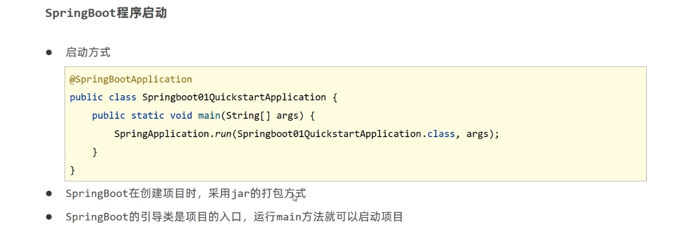

更改依赖——换 starter

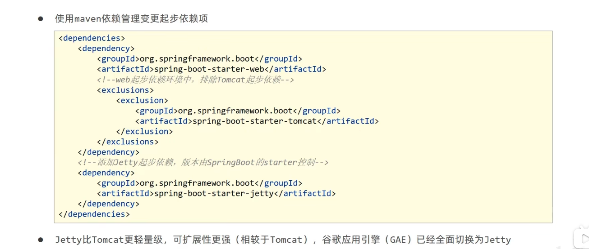

