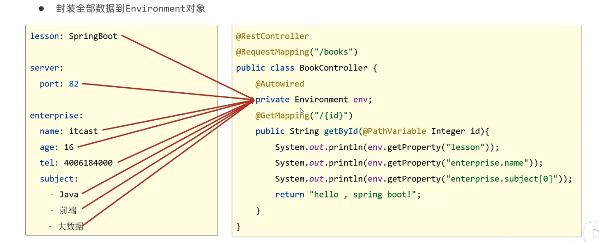

# 基础配置

3 种配置文件格式

## yaml 格式

YAML（YAML Ain't Markup Language），一种数据序列化格式

优点：
- 容易阅读
- 容易与脚本语言交互
- 以数据为核心，重数据轻格式

YAML文件扩展名
- .yml（主流）
- .yaml

### yaml 语法规则
- 大小写敏感
- 属性层级关系使用多行描述，每行结尾使用冒号结束
- 使用缩进表示层级关系，同层级左侧对齐，只允许使用空格（不允许使用Tab键）
- 属性值前面添加空格（属性名与属性值之间使用冒号+空格作为分隔）
- `#` 表示注释

核心规则：数据前面要加空格与冒号隔开

### 读取 yaml

方式一 `@Value`

方式二 Environment 对象

方式三 自定义对象

