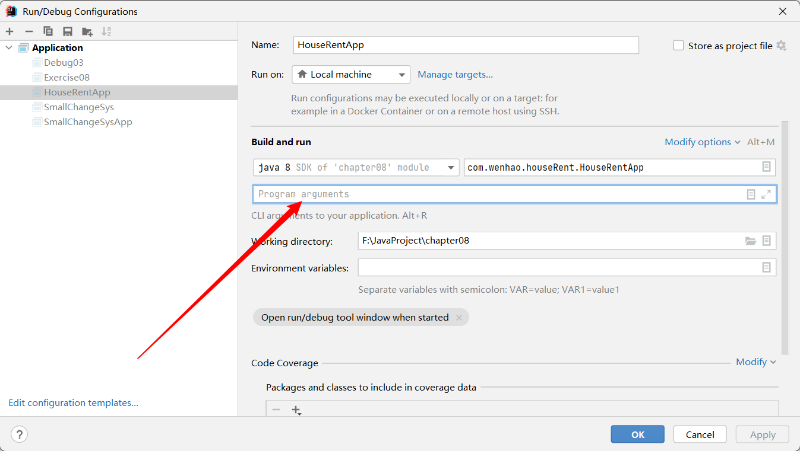

# main 方法

## 深入理解 main 方法

解释 main 方法的形式：`public static void main(String[] args){}`

1. main 方法是 java 虚拟机调用
2. java 虚拟机需要调用类的 main() 方法，所以该方法的访问权限必须是 public
3. java 虚拟机在执行 main() 方法时不必创建对象，所以该方法必须是 static
4. 该方法接收 String 类型的数组参数，该数组中保存执行 java 命令时传递给所运行的类的参数，案例演示，接收参数
5. java 执行的程序 参数1 参数2 参数3

**特别提示**

在 main() 方法中，我们可以直接调用 main 方法所在类的静态方法或静态属性。但是，不能直接访问该类中的非静态成员，必须创建该类的一个实例对象后，才能通过这个对象去访问类中的非静态成员，

**如何在 idea 中传参数**

