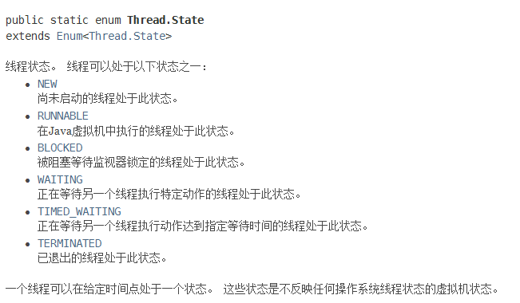
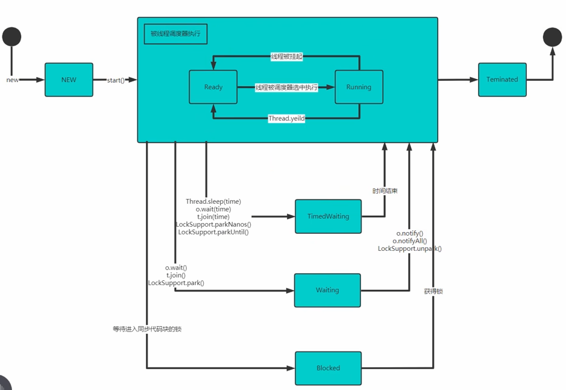

# 多线程

## 相关概念

**程序**

是为完成特定任务、用某种语言编写的一组指令的集合。简单的说：就是我们写的代码

**进程**

进程是指运行中的程序，比如：我们使用QQ，就启动了一个进程，操作系统就会为该进程分配内存空间；当我们使用迅雷，又启动了一个进程，操作系统将为迅雷分配新的内存空间。

进程是程序的一次执行过程，或是正在运行的一个程序。进程是动态过程：有它自身的产生、存在和消亡的过程

**线程**

线程由进程创建的，是进程的一个实体

一个进程可以拥有多个线程

单线程：同一个时刻，只允许执行一个线程

多线程：同一个时刻，可以执行多个线程，比如：一个qq进程，可以同时打开多个聊天窗口；一个迅雷进程，可以同时下载多个文件

**并发**：同一个时刻，多个任务交替执行，造成一种“貌似同时”的错觉，简单的说，单核 cpu 实现的多任务就是并发。

**并行**：同一个时刻，多个任务同时执行。多核 cpu 可以实现并行。电脑中可能**并发**和**并行**都存在

## 线程基本使用

### 创建线程的两种方法

在 java 中线程来使用有两种方法。

1. 继承 Thread 类，重写 run 方法

2. 实现 Runnable 接口，重写 run 方法

## 创建线程

### 继承 Thread 创建线程

```java
/**
 * @author zhaowenhao
 * @create 2022-07-04
 * @Description
 */

package com.wenhao.thread;

public class Thread01 {
    public static void main(String[] args) throws InterruptedException {
        Cat cat = new Cat();
        cat.start(); // 启动线程->最终会执行cat的run方法
		// run方法就是一个普通的方法，没有真正的启动一个线程，就会把 run 方法执行完，才向下执行
        for(int i = 0; i < 5; i++) {
            System.out.println("main thread: " + Thread.currentThread().getName());
            Thread.sleep(1100);
        }
        System.out.println("main thread exit!");
    }
}

// 当一个类继承了 Thread 类，该类就可以当作线程使用
class Cat extends Thread {
    int times = 0;

    // run 方法 实现自 Runnable 接口
    @Override
    public void run() {
//        super.run();
        while (true) {
            times++;
            System.out.println("new thread: " + Thread.currentThread().getName());
            try {
                Thread.sleep(1000);
            } catch (InterruptedException e) {
                e.printStackTrace();
            }

            if(times == 10) {
                System.out.println("new thread exit!");
                break;
            }
        }
    }
}

```

### 实现 Runnable 接口创建线程

```java
/**
 * @author zhaowenhao
 * @create 2022-07-04
 * @Description
 */

package com.wenhao.thread;

public class Thread02 {
    public static void main(String[] args) throws InterruptedException {

        // Dog 线程
        Dog dog = new Dog(); // 只有 run 方法
        Thread thread = new Thread(dog); // 这里使用了代理机制
        thread.start();

        // 主线程
        for(int i = 0; i < 5; i++) {
            System.out.println("main thread: " + Thread.currentThread().getName());
            Thread.sleep(1000);
        }
        System.out.println("main thread exit!");
    }
}

class Dog implements Runnable {

    int count = 0;

    @Override
    public void run()  {
        while(true) {
            count++;
            System.out.println("Dog thread: " + Thread.currentThread().getName());
            try {
                Thread.sleep(1000);
            } catch (InterruptedException e) {
                e.printStackTrace();
            }
            if(count == 10) {
                System.out.println("this Dog Thread exit!");
                break;
            }
        }
    }
}
```

### 对比

- java 的设计来看 ，通过继承 Thread 或者实现 Runnable 接口来创建线程本质上没有区别。从 jdk 帮助文档我们可以看到 Thread 类本身就实现了 Runnable 接口

- 实现 Runnable 接口方式更加适合**多个线程共享一个资源**的情况，并且避免了单继承的限制

## 线程终止

- 当线程完成任务后，会自动退出。

- 还可以通过使用变量来控制 run 方法退出的方式停止线程，即通知方式

```java
/**
 * @author zhaowenhao
 * @create 2022-07-04
 * @Description
 */

package com.wenhao.exit;

public class Exit_ {
    public static void main(String[] args) throws InterruptedException {

        T t = new T();
        t.start();

        Thread.sleep(1000 * 5);
        // 通知终止
        t.setLoop(false);
        System.out.println("confirm thread to exit!");

    }
}

class T extends Thread {
    private static int count = 0;
    private boolean loop = true;

    @Override
    public void run() {
        while (loop) {

            try {
                Thread.sleep(100);
            } catch (InterruptedException e) {
                e.printStackTrace();
            }

            System.out.println("T is running! " + Thread.currentThread().getName() + " " + (++count));
        }
    }

    public void setLoop(boolean loop) {
        this.loop = loop;
    }
}
```

## 线程常用方法

1. setName //设置线程名称，使之与参数 name 相同

2. getName //返回该线程的名称

3. start //使该线程开始执行；Java 虚拟机底层调用该线程的 start0 方法

4. run //调用线程对象 run 方法

5. setPriority //更改线程的优先级

6. getPriority //获取线程的优先级

7. sleep //在指定的毫秒数内让当前正在执行的线程休眠（暂停执行）

8. interrupt //中断线程

**注意事项和细节**

- start 底层会创建新的线程，调用 run，run 就是一个简单的方法调用，不会启动新线程

- 线程优先级的范围：`Thread.MIN_PRIORITY` 等

- interrupt：中断线程，但并没有真正的结束线程。所以一般用于中断正在休眠的线程（提前结束休眠）

- sleep：线程的静态方法，使当前线程休眠

9. yield：线程的礼让。让出 cpu，让其他线程执行，但礼让的时间不确定，所以也不一定礼让成功。`Thread.yield()`

10. join: 线程的插队。插队的线程一旦插队成功，则肯定先执行完插入的线程所有的任务。`t2.join()`，注意抛出 interrupt 异常

## 设置守护线程

**用户线程和守护线程**

用户线程：也叫工作线程，当线程的任务执行完或通知方式结束

守护线程：一般是为工作线程服务的，当所有的用户线程结束，守护线程自动结束，常见的守护线程：垃圾回收机制

```java
T t = new T();
t.setDaemon(true); //设置守护线程 
t.start();
```

## 线程的生命周期

查看线程状态：`t.getState()`

<div align="center">
    
</div>

RUNNABLE：Ready & Running

<div align="center">
    
</div>

## 线程同步机制

**关键字：**Synchronized，在同一时刻，只能有一个线程执行修饰的程序

**线程同步机制**

1. 在多线程编程，一些敏感数据不允许被多个线程同时访问，此时就使用同步访问技术，保证数据在任何同一时刻，最多有一个线程访问，以保证数据的完整性

2. 也可以这样理解：线程同步，即当有一个线程在对内存进行操作时，其他线程都不可以对这个内存地址进行操作，直到该线程完成操作，其他线程才能对该内存地址进行操作

**具体方法**

1. 同步代码块

```java
synchronized(对象){//得到对象的锁，才能操作同步代码
	//需要被同步代码;
}
```

2. synchronized 还可以放在方法声明中，表示整个方法为**同步方法**

```java
public synchronized void m (String name){
	//需要被同步的代码
}
```

**示例代码**

```java
/**
 * @author zhaowenhao
 * @create 2022-07-04
 * @Description
 */

package com.wenhao.Synchronized;

public class SellTicket {
    public static void main(String[] args) {
        
        SellTicket03 sellTicket03 = new SellTicket03();

        new Thread(sellTicket03).start();
        new Thread(sellTicket03).start();
        new Thread(sellTicket03).start();
    }
}

class SellTicket03 implements Runnable {
    private static int ticketNum = 100;
    private boolean loop = true;

    private synchronized void sell() {
        //
        if(ticketNum <= 0) {
//            System.out.println("窗口：" + Thread.currentThread().getName() + " 售票结束");
            System.out.println("售票结束！");
            loop =  false;
            return;
        }
        System.out.println("窗口：" + Thread.currentThread().getName() + " 售出一张票"
                + " 剩余票数：" + (--ticketNum));
        //
        try {
            Thread.sleep(200);
        } catch (InterruptedException e) {
            e.printStackTrace();
        }
    }

    @Override
    public void run() {
        while(loop) {
            this.sell();
        }
    }
}
```

## 互斥锁

**基本介绍**

1. 在Java语言中，引入了对象互斥锁的概念，来保证共享数据操作的完整性

2. 每个对象都对应于一个可称为“互斥锁”的标记，这个标记用来保证在任一时刻，只能有一个线程访问该对象

3. 关键字 synchronized 来与对象的互斥锁联系。当某个对象用synchronized修饰时，表明该对象在任一时刻只能由一个线程访问

4. 同步的局限性：导致程序的执行效率要降低

5. **同步方法**（非静态的）的锁可以是 this，也可以是其他对象（**要求是同一个对象**）
6. **同步方法**（静态的）的锁为当前类本身。

```java
// 非静态，锁加在对象身上，千万要注意线程操作同一个对象
synchronized (this) {
	system.out.println("m2");
}

// 静态，锁加在类身上
public synchronized static void m1() {
}
public static void m2() {
	synchronized (SellTicket03.class) {
		system.out.println("m2");
	}
}
```

**注意事项**

1. 同步方法如果没有使用 static 修饰：默认锁对象为 this

2. 如果方法使用 static 修饰，默认锁对象：当前类.class
3. 实现的落地步骤：
    - 需要先分析上锁的代码选择**同步代码块**或同步方法
    - 要求多个线程的锁对象为同一个!

## 线程死锁

**基本介绍**

多个线程都占用了对方的锁资源，但不肯相让，导致了死锁，在编程是一定要避免死锁的发生

## 释放锁

1. 当前线程的同步方法、同步代码块执行结束

2. 当前线程在同步代码块、同步方法中遇到 break、return

3. 当前线程在同步代码块、同步方法中出现了未处理的 Error 或 Exception，导致异常结束

4. 当前线程在同步代码块、同步方法中执行了线程对象的 wait() 方法，当前线程暂停，并释放锁

**下面操作不会释放锁**

1. 线程执行同步代码块或同步方法时，程序调用 Thread.sleep()、Thread.yield() 方法暂停当前线程的执行，不会释放锁

2. 线程执行同步代码块时，其他线程调用了该线程的 suspend() 方法将该线程挂起，该线程不会释放锁

提示：应尽量避免使用 suspend() 和 resume() 来控制线程，方法不再推荐使用


