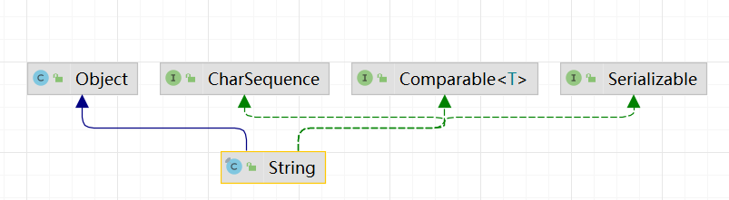
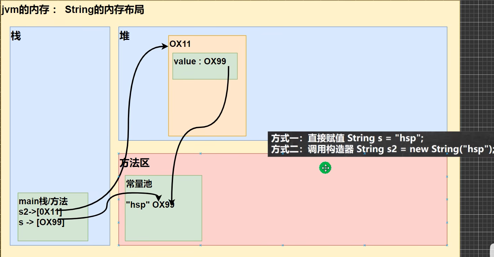

# String 类

## String 类的理解和创建对象

1. String 对象用于保存字符审，也就是一组字符序列

2. 字符串常量对象是用双引号括起的字符序列，例如："你好"、"12.97"、"boy"

3. 字符串的字符使用 Unicode 字符编码，一个字符（不区分字母还是汉字）占两个字节

4. String 类较常用构造方法

```java
String s1 = new String();
String s2 = new String(String original);
String s3 = new String(char[] a);
String s4 = new String(char[] a, int startIndex, int count)
```

5. String 继承关系图

<div>

</div>

**重点理解**

Serializable：可以串行化，进行网络传输

Comparable：对象可以相互比较

6. String 是 final 类，不能被其他的类继承

7. String 有属性 `private final char value[];` 用于存放字符串内容。一定要注意：value 是一个 final 类型，不可以修改（地址不能被修改，值可以修改）

## 两种创建 String 对象的区别

方式一：直接赋值 `String s = "hsp";`

方式二：调用构造器 `String s2 = new String("hsp");`

方式一：先从常量池查看是否有 "hsp" 数据空间，如果有，直接指向；如果没有则重新创建，然后指向。s最终指向的是常量池的空间地址

方式二：先在堆中创建空间，里面维护了 value 属性，指向常量池的 hsp 空间。如果常量池没有 "hsp"，重新创建，如果有，直接通过 value 指向。最终指向的是堆中的空间地址

<div>

</div>

## 注意事项

```java
String a = "wenhao";
String b = "zhao";
String c = a + b;  // 分析如下
```

老韩小结：底层是 `StringBuilder sb = new StringBuilder(); sb.append(a); sb.append(b);` sb 是在堆中，并且 append 是在原来字符串的基础上追加的

重要规则：`String c1 = "ab" +"cd";` 常量相加，看的是池；`String c1 =a+b;` 变量相加，是在堆中

## String 常用方法

```java
public class StringMethod01 {
    public static void main(String[] args) {
        // 1.equals
        String s1 = "hello";
        String s2 = "hello";
        System.out.println(s1.equals(s2));
        // 2.equalsIgnoreCase
        String s3 = "Hello";
        System.out.println(s1.equalsIgnoreCase(s3));
        // 3.length获取字符的个数，字符串的长度
        System.out.println("韩顺平".length());
        // 4.indexOf 获取字符在字符串对象中第一次出现的索引，索引从0开始，如果找不到，返回-1
        String s4 = "wer@terwe@g";
        int index1 = s4.indexOf('@');
        System.out.println(index1);
        // 5.lastIndexOf 获取字符子啊字符串中最后一次出现的索引，索引从0开始，如果找不到，返回-1
        String s5 = "wer@terwe@g@";
        int index2 = s5.lastIndexOf('@');
        System.out.println(index2);
        // 6.substring截取指定范围的子串
        String name = "hello,张三";
        // 下面name.substring(6)从索引6开始截取后面所有的内容
        System.out.println(name.substring(6));//截取后面的字符
        // name.substring(0,5)表示从索引0开始截取,截取到5-1位置
        System.out.println(name.substring(0,5));

    }
}
```

```java
public class StringMethod02 {
    public static void main(String[] args) {
        // 1.toUpperCase转换成大写
        String s = "heLLo";
        System.out.println(s.toUpperCase()); //HELLO
        // 2.toLowerCase
        System.out.println(s.toLowerCase());
        //3.concat拼接字符串
        String s1 ="宝玉";
        s1 = s1.concat("林黛玉").concat("薛宝似").concat("together");
        System.out.println(s1); //宝玉林黛玉薛宝钗together
        // 4.replace 替换字符串中的字符
        String s2 ="宝玉 and 林黛玉 林黛玉 林黛玉";
        //在s1中，将所有的林黛玉替换成薛宝钗
        s2 = s2.replace("林黛玉", "薛宝钗");
        System.out.println(s2);//宝玉 and 薛宝骊薛宝骊薛宝骊
        // 5.split分割字符串，对于某些分割字符，我们需要 转义比如│\\等
        String poem = "锄禾日当午，汗滴禾下土，谁知盘中餐，粒粒皆辛苦";
        //老韩解读:以，为标准对poem进行分割，返回一个数组
        String[] split = poem.split("，");
        // 6.toCharArray转换成字符数组
        String s3 ="happy";
        char[] chs = s3.toCharArray();
        // 7.compareTo 比较两个字符串的大小，如果前者大，
        // 则返回正数，后者大，则返回负数，如果相等，返回0
        // 如果长度不一样，就返回前者长度减去后者长度
        String a = "jchn" ;
        String b = "jack" ;
        System.out.println(a.compareTo(b)); // 返回值是 ‘c' - 'a' = 2的值
        // 8.format格式化字符串
        String name = "wenhao";
        int age = 22;
        float score = 99.0f;
        char gender = '男';
        String info = String.format("%s %d %.2f %c", name, age, score, gender);
        System.out.println(info);
    }
}
```

# StringBuffer 类

## 基本介绍

java.lang.StringBuffer 代表可变的字符序列，可以对字符串内容进行增删。

很多方法与 String 相同，但 StringBuffer 是可变长度的。String Buffer 是一个容器。

## String VS StringBuffer

String 保存的是字符串常量，里面的值不能更改，每次 String 类的更新实际上就是更改地址，效率较低 `//private final char valuell;`

`StringBuffer` 保存的是字符串变量，里面的值可以更改，每次 `StringBuffer` 的更新实际上可以更新内容，不用每次更新地址，效率较高

## 构造器的使用

- 创建一个大小为16的 `char[]`，用于存放字符内容
  
  `StringBuffer stringBuffer = new StringBuffer();`

- 通过构造器指定 `char[]` 大小
  
  `StringBuffer stringBuffer = new StringBuffer(100);`

- 通过给一个 String 创建 StringBuffer，char[] 大小就是 str.length() + 16
  
  `StringBuffer hello = new StringBuffer("hello");`

## String -> StringBuffer

- 使用构造器
  
  `String s = "hello"; StringBuffer str = new StringBuffer(s);`

- 使用 append()
  
  `String s = "hello"; StringBuffer sb = new StringBuffer(); sb.append(s);`

## StringBuffer -> String

- 使用 `toString()` 方法
  
  `StringBuffer sb = new StringBuffer("hello"); String s = sb.toString();`

- 使用构造器
  
  `String s1 = new String(sb);`

## StringBuffer 常用方法

- 增 append

- 删 delete(start, end) // 删除 [start,end) 之间的字符

- 改 replace(start, end, string) // 将 [start,end) 间的内容替换掉

- 查 indexOf("str") // 查找子串在字符串第1次出现的索引，如果找不到返回-1

- 插 insert(start, string) // 在start处插入string，原来内容自动后移

- 获取长度 length

# StringBuilder 类

## 基本介绍

- 一个可变的字符序列。此类提供一个与 StringBuffer 兼容的 API，但不保证同步。该类被设计用作 StringBuffer 的一个简易替换，用在字符串缓冲区被**单个线程**使用的时候。如果可能，建议优先采用该类，因为在大多数实现中，它比 StringBuffer 要快。

- 在 StringBuilder 上的主要操作是 append 和 insert 方法，可重载这些方法，以接受任意类型的数据。

## 常用方法

StringBuilder 和 StringBuffer 均代表可变的字符序列，方法是样的，所以使用和 StringBuffer 一样

注意：StringBuilder 的方法，没有做互斥的处理，即没有 synchronized 关键字，因此在单线程的情况下使用 StringBuilder

## String、StringBuffer 和 StringBuilder 的比较

1. StringBuilder 和 StringBuffer 非常莫似，均代表可变的字符序列，而且方法也一样
2. String：不可变字符序列，效率低，但是复用率高
3. StringBuffer：可变字符序列、效率较高（增删）、线程安全
4. StringBuilder：可变字符序列、效率最高、线程不安全

结论：如果对**字符串**做大量修改，不要使用 String，要使用 StringBuffer

## 使用原则

1. 如果字符串存在大量的修改操作，一般使用 StringBuffer 或 StringBuilder

2. 如果字符串存在大量的修改操作，并在单线程的情况，使用 StringBuilder

3. 如果字符串存在大量的修改操作，开仕多线程的情况，使用 StringBuffer

4. 如果我们字符串很少修改，被多个对象引用，使用String，比如配置信息等

StringBuilder 的方法使用和 StringBuffer 一样，不再说
