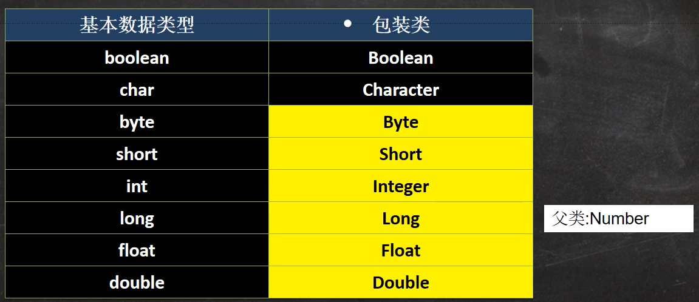
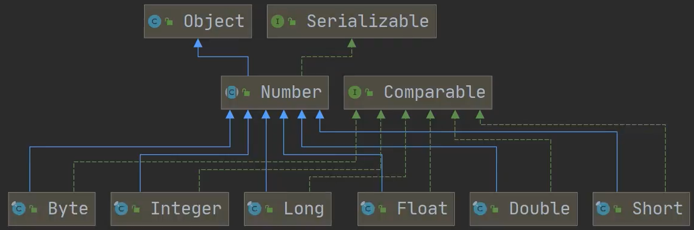

# 包装类 Wrapper

**包装类的分类**

针对八种基本数据类型相应的引用类型—包装类

有了类的特点，就可以调用类中的方法

<div>

</div>

**继承关系**

<div>

</div>

**包装类和基本数据的转换**

演示包装类和基本数据类型的相互转换，这里以 int 和 Integer 演示。

jdk5 前的手动装箱和拆箱方式，装箱：基本类型 to 包装类型，反之，拆箱

jdk5 以后（含 jdk5）的自动装箱和拆箱方式

自动装箱底层调用的是 valueOf 方法，比如 Integer.valueOf()

```java
public static void main(String[] args) {
        // 手动装箱
        int n1 = 100;
        Integer integer1 = new Integer(n1);
        Integer integer2 = Integer.valueOf(n1);
        // 手动拆箱
        int n2 = integer2.intValue();

        // jdk5之后
        // 自动装箱
        int n3 = 120;
        Integer integer3 = n3;  // 底层使用的是Integer.valueOf()
        // 自动拆箱
        int n4 = integer3;  // 底层使用的是Integer.intValue()
    }
```

**包装类型和 String 类型的相互转换**

```java
    public static void main(String[] args) {
        Integer i1 = 100;
        // Integer -> String
        // 方式1
        String s1 = "" + i1;
        // 方式2
        String s2 = i1.toString();
        // 方式3
        String s3 = String.valueOf(i1);

        // String -> Integer
        String s4 = "12345";
//        int i = Integer.parseInt(s4);
        Integer i2 = Integer.parseInt(s4);  // 自动装箱
        Integer i3 = new Integer(s4);  // 构造器
    }
```

**常用方法**

```java
public class WrapperType {
    public static void main(String[] args) {
        System.out.println(Integer.MIN_VALUE);  //返回最小值
        System.out.println(Integer.MAX_VALUE);  //返回最大值
        System.out.println(Character.isDigit('a'));  //判断是不是数字
        System.out.println(Character.isLetter('a'));  //判断是不是字母
        System.out.println(Character.isUpperCase('a'));  //判断是不是大写
        System.out.println(Character.isLowerCase('a'));  //判断是不是小写
        System.out.println(Character.isWhitespace('a'));  //判断是不是空格
        System.out.println(Character.toUpperCase('a'));  //转成大写
        System.out.println(Character.toLowerCase('A'));  //转成小写
    }
}
```

# 
