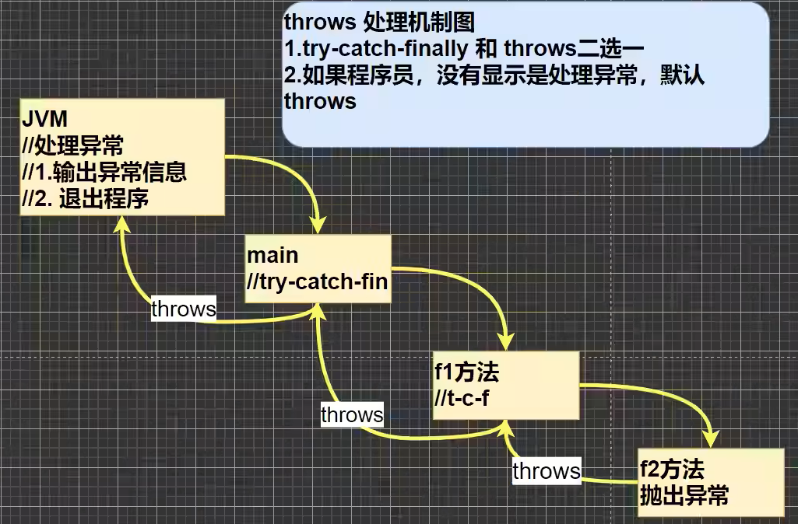

# 异常

> idea 快捷键：选中代码块，ctrl+atl+t，try-catch

- 异常分为两大类，**运行时异常**和**编译时异常**

- 运行时异常，编译器不要求强制处置的异常。一般是指编程时的逻辑错误，是程序员应该避免其出现的异常。java.lang.RuntimeException 类及它的子类都是运行时异常

- 对于运行时异常，可以不作处理，因为这类异常很普遍，若全处理可能会对程序的可读性和运行效率产生影响 

- 编译时异常（Exception 类），是编译器要求必须处置的异常

## 常见的运行时异常包括

> 父类是 RuntimeException

- NullPointerException 空指针异常

- ArithmeticException数学运算异常

- ArraylndexOutOfBoundsException 数组下标越界异常

- ClassCastException 类型转换异常

- NumberFormatException 数字格式不正确异常

## 异常处理的方式

1) try-catch-finally
   程序员在代码中捕获发生的异常，自行处理
2) throws
   将发生的异常抛出，交给调用者（方法）来处理，最顶级的处理者就是 JVM

## 异常处理机制

**try-catch-finally 机制**

```java
try {
    代码 //可能有异常
} catch(Exception e) {
// 捕获到异常
//1. 当异常发生时
//2. 系统将异常封装成 Exception 对象e，传递给catch
//3.得到异常对象后，程序员，自己处理
//4.注意，如果没有发生异常catch代码块不执行
} finally {
    // 不管 try 代码块是否有异常发生，始终要执行 finally
    // 所以，通常将释放资源的代码，放在 finally
}
```

**throws 机制**

<div align="center">

</div>

**自定义异常**

| throws VS. throw | 意义           | 位置    | 后面跟的东西 |
|:----------------:|:------------:|:-----:|:------:|
| throws           | 异常处理的一种方式    | 方法声明处 | 异常类型   |
| throw            | 手动生成异常对象的关键字 | 方法体中  | 异常对象   |
