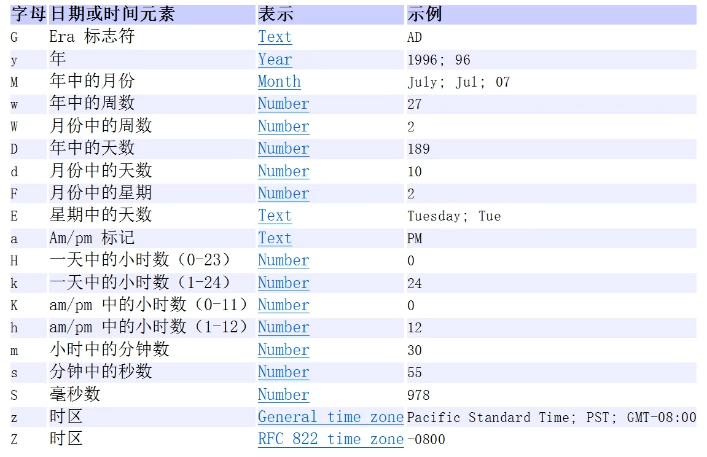

# 日期类

## 第一代日期类

Date：精确到毫秒，代表特定的瞬间

SimpleDateFormat：格式和解析日期的类

SimpleDateFormat 格式化和解析日期的具体类。它允许进行格式化（日期->文本）、解析（文本->日期）和规范化.

<div>

</div>

```java
import java.text.ParseException;
import java.text.SimpleDateFormat;
import java.util.Date;

public class Data_ {
    public static void main(String[] args) throws ParseException {
        Date date = new Date();
        System.out.println(date);
        // 转换格式
        SimpleDateFormat sdf = new SimpleDateFormat("yyyy-MM-dd hh:mm:ss E");
        String t = sdf.format(date);
        System.out.println(t);

        String t1 = "2022-06-26 08:34:12 星期二";
        Date date1 = sdf.parse(t1); // 添加一个异常
        System.out.println(date1);
    }
}
```

## 第二代日期类

第二代日期类，主要就是 Calendar 类（日历）

`public abstract class Calendar extends Object implements Serializable, Cloneable, Comparable<Calendar>`

Calendar 类是一个抽象类（构造器是私有化的），它为特定瞬间与一组诸如 YEAR、MONTH、DAY_ OF MONTH、HOUR 等日历字段之间的转换提供了一些方法，并为操作日历字段（例如获得下星期的日期）提供了一些方法

```java
public class Data_ {
    public static void main(String[] args) throws ParseException {
        Calendar c = Calendar.getInstance();
//        System.out.println(c);
        System.out.println(c.get(Calendar.YEAR));
        System.out.println(c.get(Calendar.MONTH) + 1);
        System.out.println(c.get(Calendar.DAY_OF_MONTH));
        System.out.println(c.get(Calendar.HOUR));
        System.out.println(c.get(Calendar.MINUTE));
        System.out.println(c.get(Calendar.SECOND));
    }
}
```

## 第三代日期类 JDK8 加入

前面两代曰期类的不足分析：

JDK 1.0 中包含了一个 java.util.Date 类，但是它的大多数方法已经在 JDK 1.1 引入 Calendar 类之后被弃用了。而 Calendar 也存在问题是:

1. 可变性：像曰期和时间这样的类应该是不可变的

2. 偏移性：Date 中的年份是从 1900 开始的，而月份都从 0 开始

3. 格式化:格式化只对Date有用，Calendar 则不行

4. 此外，它们也不是线程安全的；不能处理闰秒等（每隔2天，多出1s）

### 第三代日期类常见方法

LocalDate（日期/年月日）、LocalTime（时间/时分秒）、LocalDateTime（日期时间）

- LocalDate 只包含日期，可以获取日期字段 

- LocalTime 只包含时间，可以获取时间字段

- LocalDateTime 包含日期+时间，可以获取日期和时间字段

DateTimeFormatter 格式日期类类似于 SimpleDateForma

`DateTimeFormatter dtf = DateTimeFormatter.ofPattern(格式); String str = dtf.format(日期对象);`

```java
public class LocalDate_ {
    public static void main(String[] args) {
        // 当前日期对象
        LocalDateTime ldt = LocalDateTime.now(); // LocalDate.now() LocalTime.now()
//        System.out.println(ldt);
        // 添加时间
        LocalDateTime ldt1 = ldt.plusDays(21);
        // 减去时间
        LocalDateTime ldt2 = ldt.minusHours(12);
        // 格式化
        DateTimeFormatter dtf = DateTimeFormatter.ofPattern("yyyy-MM-dd hh:mm:ss E");
        String str = dtf.format(ldt);
        String str1 = dtf.format(ldt1);
        String str2 = dtf.format(ldt2);
        // 打印
        System.out.println(str);
        System.out.println(str1);
        System.out.println(str2);ntln(str1);
//        ldt.getYear();
//        ldt.getMonthValue();
//        ldt.getMonth();
//        ldt.getDayOfMonth();
//        ldt.getHour();
//        ldt.getMinute();
//        ldt.getSecond();
    }
}
```


