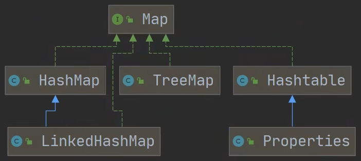

# 集合

集合主要是两组（单列集合，双列集合）

Collection 接口有两个重要的子接口 List、Set，他们的实现子类都是单列集合

Map 接口的实现子类是双列集合，存放的K-V

**Collection 体系图**

<div align="center">

</div>

**Map 体系图**

<div align="center">

</div>

## Collection 接口

**Collection 接口实现类的特点**

`public interface Collection<E> extends Iterable<E>`

- Collection 实现子类可以存放多个元素，每个元素可以是 Object

- 有些 Collection 的实现类，可以存放重复的元素，有些不可以

- 有些 Collection 的实现类，有些是有序的（List），有些不是有序（Set）

- Collection 接口没有直接的实现子类，是通过它的子接口 Set 和 List 来实现的

### Collection 接口和常用方法

```java
public class collection_ {
    public static void main(String[] args) {
        List<Integer> list = new ArrayList<Integer>();
        // 添加
        list.add(1); // 自动装箱
        list.add(2);
        list.add(4);
        list.add(16);
        System.out.println(list);
        // 删除
        System.out.println(list.remove(new Integer(1)));
        list.remove(1);
        System.out.println(list);
        // 查找
        System.out.println(list.contains(16));
        System.out.println(list.contains(1));
        // 元素个数
        System.out.println(list.size());
        // 是否为空
        System.out.println(list.isEmpty());
        // 清空元素
//        list.clear();
        // 添加多个元素
        List<Integer> list1 = new ArrayList<Integer>();
        list1.add(22);
        list1.add(41);
        list1.add(136);
        list.addAll(list1);
        System.out.println(list);
        // 查找多个元素是否都在
        System.out.println(list.containsAll(list1));
        // 删除删除多个元素
        list.removeAll(list1);
        System.out.println(list);
    }
}
```

### Collection 接口遍历元素方式1：使用 lterator（迭代器）

**基本介绍**

Iterator 对象称为迭代器，主要用于遍历 Collection 集合中的元素

所有实现了Collection 接口的集合类都有一个 iterator 方法，用以返回一个实现了 lterator 接口的对象，即可以返回一个迭代器

Iterator 的结构

Iterator 仅用于遍历集合，Iterator 本身并不存放对象。

**迭代器的执行原理**

```java
lterator iterator = coll.iterator(); // 得到一个集合的迭代器
// hasNext()：判断是否还有下一个元素
while(iterator.hasNext()){
// next()：指针下移、将下移以后集合位置上的元素返回
System.out.println(iterator.next());
}
```

```java
public class Iterator_ {
    @SuppressWarnings({"all"})
    public static void main(String[] args) {

        ArrayList<Book> books = new ArrayList<Book>();
        books.add(new Book("wen", 123));
        books.add(new Book("hao", 132));
        books.add(new Book("zhao", 324));

        Iterator<Book> iterator = books.iterator();

        while (iterator.hasNext()) { // 快捷键 itit, ctrl+j 显示所有快捷键
            Object obj =  iterator.next();
            System.out.println(obj);
        }
    }
}
```

### Collection 接口遍历元素方式2：增强 for 循环

**基本语法**

`for(元素类型 元素名 : 集合名或数组名){ 访问元素 }`

```java
// 增强for 底层仍然是方法一
for (Object obj : books) { // 快捷键 I
    System.out.println(obj);
}
```

## List 接口

### List 接口基本介绍

List 接口是 Collection 接口的子接口

List 集合类中元素有序（即添加顺序和取出顺序一致）、且可重复

List 集合中的每个元素都有其对应的顺序索引，即支持索引

List 容器中的元素都对应一个整数型的序号记载其在容器中的位置，可以根据序号存取容器中的元素

JDK API 中 List 接口的实现类有：

<div align="center">

</div>

### List 接口常用方法

List 集合里添加了一些根据索引来操作集合元素的方法

- `void add(int index, Object ele)`：在index位置插入 ele 元素

- `boolean addAll(int index, Collection eles)`：从 index 位置开始将 eles 中的所有元素添加进来

- `Object get(int index)`：获取指定 index 位置的元素

- `int indexOf(Object obj)`：返回 obj 在集合中首次出现的位置

- `int lastIndexOf(Object obj)`：返回 obj 在当前集合中末次出现的位置

- `Object remove(int index)`：移除指定 index 位置的元素，并返回此元
  素

- `Object set(int index, Object ele)`：设置指定 index 位置的元素为 ele，相当于是替换

- `List subList(int fromlndex, int tolndex)`：返回 [fromIndex, tolndex) 位置的子集合

### List 遍历方式

与 collection 一样

## ArrayList 类

ArrayList 可以加入 null，并且可以多个

ArrayList是由数组来实现数据存储的

ArrayList 基本等同于 Vector，除了 ArrayList 是线程不安全（执行效率高）看源码；在多线程情况下，不建议使用 ArrayList

### 底层机制

ArrayList 中维护了一个 Object 类型的数组 elementData

`transient Object[] elementData;`  // transient 表示瞬间，短暂的，表示该属性不会被序列号

- 当创建ArrayList对象时，如果使用的是无参构造器，则初始 elementData 容量为 0，第1次添加，则扩容 elementData 为 10，如需要再次扩容，则扩容 elementData 为1.5倍。

- 如果使用的是指定大小的构造器，则初始 elementData 容量为指定大小，如果需要扩容，则直接扩容 elementData 为1.5倍。

## Vector 类

Vector 底层也是一个对象数组 `protected Object[l elementData;`

Vector 是线程同步的，即线程安全，Vector 类的操作方法带有 synchronized

```java
public synchronized E get(int index){
    if (index >= elementCount)
        throw new ArrayIndexOutOfBoundsException(index);
    return elementData(index);
}
```

在开发中，需要线程同步安全时，考虑使用 Vector

## LinkedList 类

### 简单介绍12341234325435

- LinkedList 底层实现了双向链表和双端队列特点

- 可以添加任意元素（元素可以重复），包括 null

- 线程不安全，没有实现同步

### LinkedList 的底层操作机制

- LinkedList 底层维护了一个双向链表

- LinkedList 中维护了两个属性 first 和 last 分别指向首节点和尾节点

- 每个节点（Node 对象），里面又维护了 prev、next、item三个属性，其中通过 prev 指向前一个，通过 next 指向后一个节点，最终实现双向链表

- 所以 LinkedList 的元素的添加和删除，不是通过数组完成的，相对来说效率较高

## 对比

如何选择 ArrayList 和 LinkedList：

- 如果我们改查的操作多，选择 ArrayList

- 如果我们增删的操作多，选择 LinkedList

- 一般来说，在程序中，80%-90%都是查询，因此大部分情况下会选择 ArrayList

- 在一个项自中，根据业务灵活选择，也可能这样，一个模块使用的是 ArrayList，另外一个模块是 LinkedList
