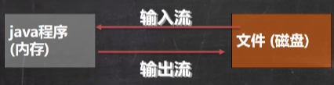
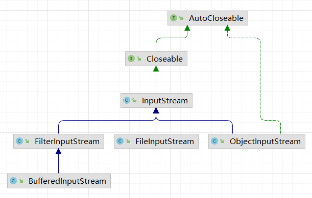
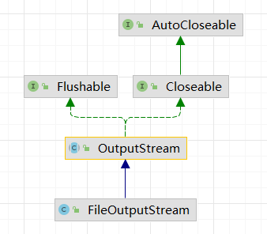
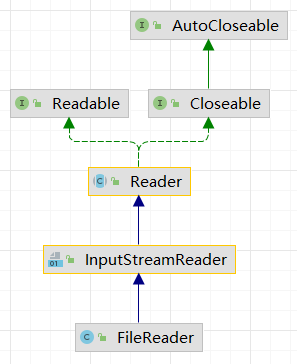
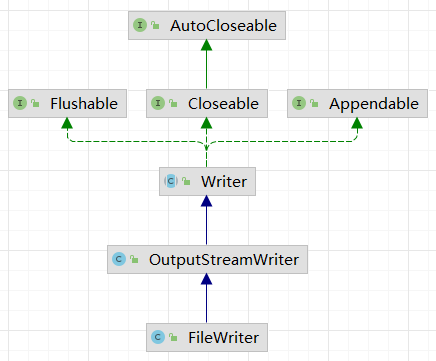

# 文件IO流

文件流

文件在程序中是以流的形式来操作的

<div align="center">
    
</div>

流：数据在数据源（文件）和程序（内存）之间经历的路径

输入流：数据从数据源（文件）到程序（内存）的路径

输出流：数据从程序（内存）到数据源（文件）的路径

## 常用文件操作

### 创建文件对象

**相关构造器和方法：**

- new File(String pathname) //根据路径构建一个File对象

- new File(File parent,String child) //根据父目录文件+子路径构建

- new File(String parent,String child) //根据父目录+子路径构建

- createNewFile 创建新文件

```java
// method 1 new File(String path)
@Test
public void create01() throws IOException {
    // create the file obj in memory
    String filePath = "f:\\news1.txt";
    File file = new File(filePath);

    file.createNewFile(); // create the file in disk
    System.out.println("Successfully create the file in method 1");
}

// method 2 new File(File parent, String path)
@Test
public void create02() throws IOException {
    File parentDir = new File("f:\\");
    String path = "news2.txt";
    File file = new File(parentDir, path);

    file.createNewFile();
    System.out.println("Successfully create the file in method 2");
}

// method 3 new File(String parent, String path)
@Test
public void create03() throws IOException {
    String parent = "f:\\";
    String path = "news3.txt";
    File file = new File(parent, path);

    file.createNewFile();
    System.out.println("Successfully create the file in method 3");
}
```

### 获取文件信息

getName、getAbsolutePath、getParent、length、exists、isFile、isDirectory

```java
File file = new File("f:\\news1.txt");

// invoke the File method
System.out.println("file name: " + file.getName());
System.out.println("file path: " + file.getAbsolutePath());
System.out.println("file parent path: " + file.getParent());
System.out.println("file char size: " + file.length());
System.out.println("file exists: " + file.exists());
System.out.println("file is a file: " + file.isFile());
System.out.println("file is a dir: " + file.isDirectory());
```

### 文件（目录）的创建、删除

> 在 java 中目录也被当作文件

mkdir 创建一级目录、mkdirs 创建多级目录、delete 删除空目录或文件

```java
// delete the file if it exists!
@Test
public void m1() {
    String filePath = "f:\\news3.txt";
    File file = new File(filePath);
    if(file.exists()) {
        if(file.delete()) {
            System.out.println(filePath + " is deleted!");
        }
    } else {
        System.out.println("this file does not exist!");
    }
}

// delete the dir if it exists!
@Test
public void m2() {
    String filePath = "f:\\fileDir";
    File file = new File(filePath);
    if(file.exists()) {
        if(file.delete()) {
            System.out.println(filePath + " is deleted!");
        }
    } else {
        System.out.println("this dir does not exist!");
    }
}

// make the dir if it does not exist!
// mkdirs: make the multi-level dirs
// mkdir: make a dir
@Test
public void m3() {
    String filePath = "f:\\a\\b\\c";
    File file = new File(filePath);
    if(file.exists()) {
        System.out.println("this dir does exist!");
    } else {
        if(file.mkdirs()) {
            System.out.println("Successfully make th dir");
        } else {
            System.out.println("failed to make th dir");
        }
    }
}
```

## IO 流原理及流的分类

### Java IO流原理

1. I/O 是 Input/Output 的缩写，I/O 技术是非常实用的技术，用于处理数据传输。如：读/写文件，网络通讯等。

2. Java 程序中，对于数据的输入/输出操作以”流（stream）”的方式进行。
3. java.io 包下提供了各种“流”类和接口，用以获取不同种类的数据，并通过方法输入或输出数据

4. 输入 input：读取外部数据（磁盘、光盘等存储设备的数据）到程序（内存）中。
5. 输出 output：将程序（内存）数据输出到磁盘、光盘等存储设备中

### 流的分类

按操作数据单位不同分为：**字节流**（8 bit）适用于**二进制**文件，**字符流**（按字符）适用于**文本**文件

按数据流的流向不同分为：输入流，输出流

按流的角色的不同分为：节点流，处理流/包装流

| 抽象基类 | 字节流       | 字符流 |
| -------- | ------------ | ------ |
| 输入流   | InputStream  | Reader |
| 输出流   | OutputStream | Writer |

Java 的 IO 流共涉及 40 多个类，实际上非常规则，都是从如上 4 个抽象基类派生的，由这四个类派生出来的子类名称都是以其父类名作为子类名后缀。

## 字节流

InputStream 抽象类是所有类字节输入流的超类 

InputStream 常用的子类：

1. FilelnputStream：文件输入流
2. BufferedInputStream：缓冲字节输入流
3. ObjectlnputStream：对象字节输入流

**继承关系图**

<div align="center">
    
</div>

### FilelnputStream

> 用 FilelnputStream 读取 hello.txt 文件, 并将文件内容显示到控制台

```java
// 使用 read() 方法
String filename = "f://helloworld.txt";
FileInputStream fileInputStream = null;
int readData = 0;

try {
    fileInputStream = new FileInputStream(filename);
    while((readData = fileInputStream.read()) != -1) {
    	System.out.print((char)readData);
	}
} catch (IOException e) { // catch IOException
	e.printStackTrace();
} finally {
    try {
        fileInputStream.close();
    } catch (IOException e) {
        e.printStackTrace();
    }
}

// optim 使用 read(bety[] b) 方法
String filename = "f://helloworld.txt";
FileInputStream fileInputStream = null;
byte[] buffer = new byte[8];
int readLen = 0;

try {
    fileInputStream = new FileInputStream(filename);
    while((readLen = fileInputStream.read(buffer)) != -1) {
        System.out.print(new String(buffer, 0, readLen)); // print
    }
} catch (IOException e) { // catch IOException
    e.printStackTrace();
} finally {
    try {
        fileInputStream.close();
    } catch (IOException e) {
        e.printStackTrace();
    }
}
```

### FileOutputStream

**继承关系图**

<div align="center">
    
</div>

```java
public static void main(String[] args) {
    String filePath = "f:\\a.txt";
    FileOutputStream fileOutputStream = null;

    try {
        // fileOutputStream = new FileOutputStream(filePath); // 覆盖方式写入文件
        fileOutputStream = new FileOutputStream(filePath, true); // 追加方式写入文件
        String data = "hello, world!";
        // fileOutputStream.write('a'); // write a byte
        // fileOutputStream.write(data.getBytes()); // // write a byte[]
        fileOutputStream.write(data.getBytes(), 0, 5);
    } catch (IOException e) {
        e.printStackTrace();
    } finally {
        try {
            fileOutputStream.close();
        } catch (IOException e) {
            e.printStackTrace();
        }
    }
}
```

## 字符流

**继承关系图**

<div align="center">
     &nbsp 
    
</div>
### FileReader

**FileReader 相关方法：**

1) new FileReader(File/String)
2) read：每次读取单个字符，返回该字符，如果到文件末尾返回-1
3) read(char[])：批量读取多个字符到数组，返回读取到的字符数，如果到文件末尾返回-1

**相关API:**

5) new String(char[])：将 char[] 转换成 String
6) new String(char[],off,len):将 char[] 的指定部分转换成 String

```java
String filePath = "f://a.txt";
FileReader fileReader = null;
char[] buffer = new char[16];
try {
    fileReader = new FileReader(filePath);
    int readLen = 0;
    while((readLen = fileReader.read(buffer)) != -1) {
        System.out.println(new String(buffer, 0, readLen));
    }

} catch (IOException e) {
    e.printStackTrace();
} finally {
    try {
        if(fileReader != null) {
            fileReader.close();
        }
    } catch (IOException e) {
        e.printStackTrace();
    }
}
```

### FileWriter

**FileWriter 常用方法：**

1) new FileWriter(File/String)：覆盖模式，相当于流的指针在首端
2) new FileWriter(File/String,true)：追加模式，相当于流的指针在尾端
3) write(int)：写入单个字符
4) write(char[])：写入指定数组
5) write(char[],off,len)：写入指定数组的指定部分6) write (string):写入整个字符串
6) write(string,off,len)：写入字符串的指定部分

相关APl：String类：toCharArray：将String转换成 char[]

注意：FileWriter 使用后，必须要关闭（close）或刷新（flush），否则写入不到指定的文件!

```java
String filePath = "f:\\a.txt";
FileWriter fileWriter = null;
char[] data = {'赵','文','豪'};

try {
    fileWriter = new FileWriter(filePath);
    // fileWriter.write('赵');
    fileWriter.write(data);
    fileWriter.write("喜欢学习！".toCharArray(), 0, 5);
    fileWriter.write("\n喜欢学习！");
    fileWriter.write("\n喜欢学习！", 3, 2);
} catch (IOException e) {
    e.printStackTrace();
} finally {
    try {
        if(fileWriter != null) {
            fileWriter.close();
        }
    } catch (IOException e) {
        e.printStackTrace();
    }
}
```

## 节点流和处理流

1. 节点流可以从一个特定的数据源读写数据，如：FileReader、FileWriter

2. 处理流（也叫包装流）是“连接”在已存在的流（节点流或处理流）之上，为程序提供更为强大的读写功能，如：BufferedReader、BufferedWriter。BufferedReader 类中，有属性Reader，即可以封装一个节点流
    该节点流可以是任意的，只要是 Reader 子类

**节点流和处理流的区别和联系**

1. 节点流是底层流/低级流，直接跟数据源相接

2. 处理流包装节点流，既可以消除不同节点流的实现差异，也可以提供更方便的方法来完成输入输出

3．处理流（也叫包装流）对节点流进行包装，使用了修饰器设计模式，不会直接与数据源相连

**处理流的功能主要体现在以下两个方面：**

1. 性能的提高：主要以增加缓冲的方式来提高输入输出的效率

2. 操作的便捷：处理流可能提供了一系列便捷的方法来一次输入输出大批量的数据，使用更加灵活方便

### BufferedReader

> BufferedReader 和 BufferedWriter 属于字符流（处理文本文件），是按照字符来读取数据的关闭时处理流，只需要关闭外层流即可

```java
String filePath = "f:\\a.txt";
// 创建处理流
BufferedReader bufferedReader = new BufferedReader(new FileReader(filePath));
// 读文件
String line;
while((line = bufferedReader.readLine()) != null) {
    System.out.println(line);
}
// 关闭外层流
bufferedReader.close();
```

### BufferedWriter

```java
String filePath = "f:\\a.txt";
BufferedWriter bufferedWriter = new BufferedWriter(new FileWriter(filePath, true));
bufferedWriter.newLine(); // 自动换行 与系统相关
bufferedWriter.write("你好，我是文豪！");
bufferedWriter.close();
```

### 字符处理流拷贝文件

```java
String srcFile = "f:\\a.txt";
String desFile = "f:\\b.txt";
String buffer;

BufferedReader bufferedReader = new BufferedReader(new FileReader(srcFile));
BufferedWriter bufferedWriter = new BufferedWriter(new FileWriter(desFile, true));

// copy the content
while((buffer = bufferedReader.readLine()) != null) {
    bufferedWriter.write(buffer); // 读取一行但是 没有读换行
    bufferedWriter.newLine();
}
System.out.println("copy successfully!");

// close the file
bufferedReader.close();
bufferedWriter.close();
```

### 字节处理流拷贝文件

> 处理二进制文件：图片、视频等二进制文件；当然也可以处理文本文件

```java
String srcFile = "f:\\a.jpg";
String desFile = "f:\\b.jpg";
byte[] buffer = new byte[1024];
int readLen = 0;

// build stream
BufferedInputStream bufferedInputStream = new BufferedInputStream(new FileInputStream(srcFile));
BufferedOutputStream bufferedOutputStream = new BufferedOutputStream(new FileOutputStream(desFile));

while((readLen = bufferedInputStream.read(buffer)) != -1) {
    bufferedOutputStream.write(buffer, 0, readLen);
}
System.out.println("copy successfully");

// close stream
bufferedInputStream.close();
bufferedOutputStream.close();
```

