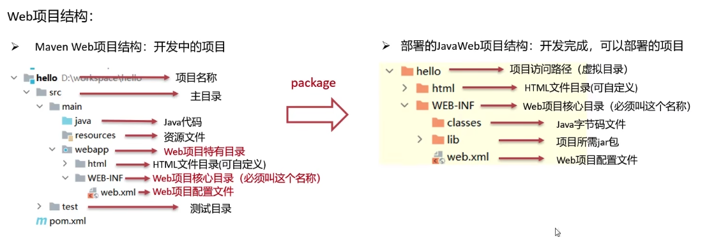
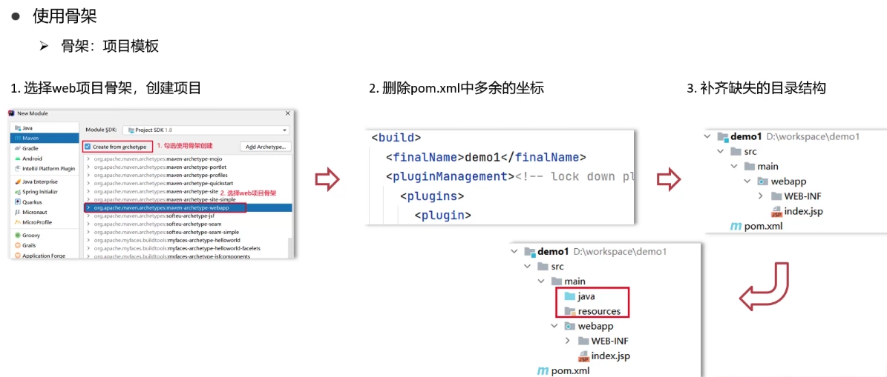

# Tomcat

## Web 服务器

Web 服务器是一个应用程序（软件），对 HTTP 协议的操作进行封装，使得程序员不必直接对协议进行操作，让 Web 开发更加便捷。主要功能是**提供网上信息浏览服务**
- 封装 HTTP 协议操作，简化开发
- 可以将 web 项目部署到服务器中，对外提供网上浏览服务

## Tomcat

**Tomcat** 是 Apache 软件基金会一个核心项目，是一个开源免费的**轻量级 Web 服务器**，支持 Servlet/JSP 少量 JavaEE 规范。

JavaEE：Java Enterprise Edition，Java 企业版。指 Java 企业级开发的技术规范总和。包含 13 项技术规范：JDBC、JNDI、EJB、RMI、JSP、Servlet、XML、JMS、Java IDL、 JTS、JTA、JavaMail、JAF

Tomcat 也被称为 **Web 容器**、**Servlet 容器**。Servlet 需要依赖于 Tomcat 才能运行

## 基本使用

### 下载

[官网](https://tomcat.apache.org/)

### 安装

我的安装路径在 /usr/local/ 目录下

### tomcat 文件简介

- bin 目录：
    - startup.sh **启动 tomcat**
    - shutdown.sh **关闭 tomcat**
- conf 目录：放置配置文件
- lib 目录：放置了很多依赖 jar 包
- logs 目录：放置日志文件
- temp 目录：存放运行过程中产生的临时文件和数据
- webapps 目录：防止将来的 web 项目
- work 目录：放置项目运行过程中产生的临时文件和数据

### 删除

直接删除文件夹

### 配置

修改启动端口号：conf/server.xml

HTTP 协议默认端口号为 80，如果将 Tomcat 端口号改为 80，则将来访问 Tomcat 时，不用输入端口号

```xml
<Connector port="80" protocol="HTTP/1.1"
    connectionTimeout="20000"
    redirectPort="8443"
    maxParameterCount="1000"
    />
```

启动时可能出现的问题
- 端口号冲突：找到对应程序，将其关闭掉
- 启动窗口一闪而过：检查 JAVA_HOME 环境变量是否正确配置

### 部署项目

- 将项目放置到 webapps 目录下，即部署完成
- 一般把 JavaWeb 项目打成 war 包，然后将 war 包放到 webapps 目录下，Tomcat 会自动解压缩 war 文件

## web 项目结构



- 编译后的 Java 字节码文件和 resources 的资源文件，放到 WEB-INF 下的 classes 目录下
- pom.xml 中依赖坐标对应的 jar 包，放入 WEB-INF 下的 lib 目录下

## 创建一个 web 项目



## 打包成 war 包

pom 文件中添加：

```xml
<packaging>war</packaging>
```

## 使用 Maven tomcat 插件

pom 中添加插件：

```xml
<build>
    <plugins>
        <!-- tomcat 插件 -->
        <plugin>
            <groupId>org.apache.tomcat.maven</groupId>
            <artifactId>tomcat7-maven-plugin</artifactId>
            <version>2.2</version>
            <configuration>
                <port>80</port>
                <path></path> <!-- 访问路径 -->
            </configuration>
        </plugin>
    </plugins>
</build>
```


