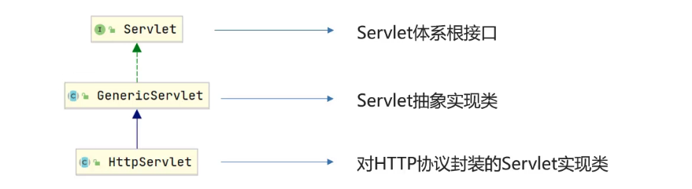

# Servlet

## 简介

Servlet 是 Java 提供的一门动态 web 资源开发技术

Servlet 是 JavaEE 规范之一，其实就是一个接口，将来我们需要定义 Servlet 类实现 Servlet 接口，并由 web 服务器运行 Servlet

## 快速入门

## Servlet 执行流程

Servlet 由谁创建，Servlet 方法由谁调用？
- Servlet 由 web 服务器创建，Servlet 方法由 web 服务器调用

服务器怎么知道 Servlet 中一定有 service 方法？
- 因为自定义的 Servlet，必须实现 Servlet 接口并复写其方法，而 Servlet 接口中有 service 方法

## Servlet 生命周期

> 对象的生命周期指一个对象从被创建到被销毁的整个过程

Servlet 运行在 Servlet 容器（web服务器，如：tomcat）中，其生命周期由容器来管理，分为 4 个阶段：
- 加载和实例化：默认情况下，当 Servlet 第一次被访问时，由容器创建 servlet 对象
- 初始化：在 Servlet 实例化之后，容器将调用 Servlet 的 init() 方法初始化这个对象，完成一些如加载配置文件、创建连接等初始化的工作。该方法只调用一次
- 请求处理：每次请求 Servlet 时，Servlet 容器都会调用 Servlet 的 service() 方法对请求进行处理
- 服务终止：当需要释放内存或者容器关闭时，容器就会调用 Servlet 实例的 destroy() 方法完成资源的释放。在destroy() 方法调用之后，容器会释放这个 Servlet 实例，该实例随后会被 Java 的垃圾收集器所回收

## Servlet 体系结构



将来开发 B/S 架构的 web 项目，都是针对 HTTP 协议，所以自定义 Servlet，会继承 HttpServlet
- 继承 HttpServlet 类
- 重写 doget() 方法：处理 get 请求
- 重写 dopost() 方法：处理 post 请求

HttpServlet 中为什么要根据请求方式的不同，调用不同方法？
- 因为不同的请求方式中，存放请求信息的位置不一样！

## Servlet urlPattern 配置

Servlet 要想被访问，必须配置其访问路径（urlPattern）

一个 Servlet，可以配置多个 urlPattern

```java
@WebServlet(urlPatterns = {"/demo1","/demo2})
```

urlPattern 配置规则
1. 精确匹配，常用
    - 配置路径：`@WebServLet("/usr/select")`
    - 访问路径：`localhost:8080/web-demo/usr/select`
2. 目录匹配
    - 配置路径：`@WebServLet("/usr/*")`
    - 访问路径：`localhost:8080/web-demo/usr/a` 或者 `localhost:8080/web-demo/usr/b`
3. 扩展名匹配
    - 配置路径：`@WebServLet("*.do")`
    - 访问路径：`localhost:8080/web-demo/a.do`
4. 任意匹配，不要用
    - 配置路径：`@WebServLet("/")` 或者 `@WebServLet("/*")`
    - 访问路径：`localhost:8080/web-demo/任意路径`
    - `/` 和 `/*` 区别：
        * 当项目中的 Servlet 配置了 `/`，会覆盖掉 tomcat 中的 DefaultServlet，DefaultServlet 负责处理静态资源请求的响应
        * 当项目中配置了 `/*`，意味着匹配任意访问路径

优先级：
- 精确路径 > 目录路径 > 扩展名路径 > `/*` > `/`

## XML 配置方式编写 Servlet

Servlet 从 3.0 版本后开始支持使用注解配置，3.0 版本前只支持 XML 配置文件的配置方式

步骤:
1. 编写 Servlet类
2. web.xml 中配置该 Servlet

```xml
<servlet>
    <servlet-name>demo5</servlet-name>
    <servlet-class>com.itheima.web.servlet.ServletDemo5</servlet-class>
</servlet>
<servlet-mapping>
    <servlet-name>demo5</servlet-name>
    <url-pattern>/demo5</url-pattern>
</servlet-mapping>
```


