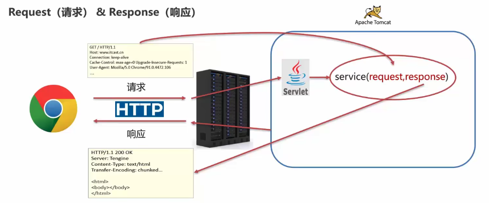
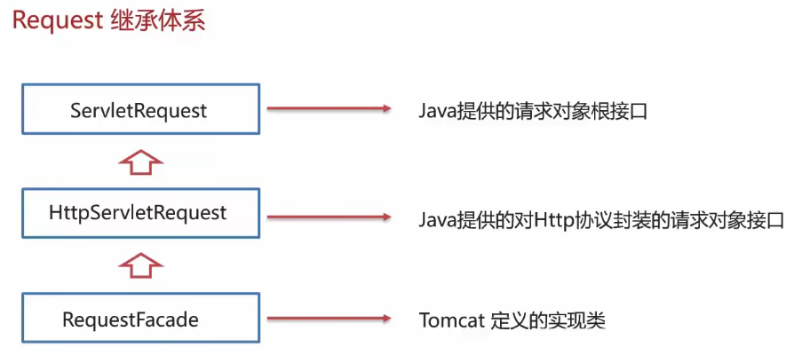
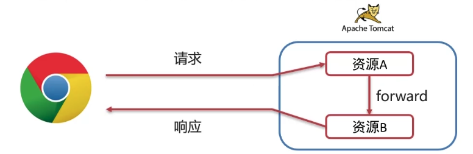
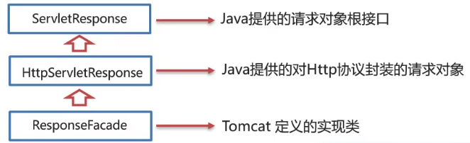
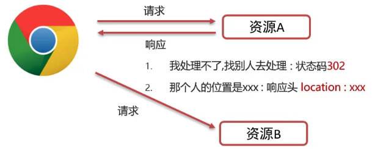

# request & response



Request：获取请求数据
Response：设置响应数据

## request

### request 继承体系



Tomcat 需要解析请求数据，封装为 request 对象并且创建 request 对象传递到 service 方法中

使用 request 对象，查阅 JavaEE API 文档的 HttpServletRequest 接口

### request 获取请求数据

请求数据分为 3 部分：
1. 请求行：`GET /request-demo/req1?username=zhangsan HTTP/1.1`
    - `String getMethod()`：获取请求方式 GET
    - `String getContextPath()`：获取虚拟目录（项目访问路径）/request-demo
    - `StringBuffer getRequestURL()`：获取 URL（统一资源定位符）http://localhost:8080/request-demo/req1
    - `String getRequestURI`：获取URI（统一资源标识符）/request-demo/req1
    - `String getQueryString()`：获取请求参数（GET方式）username=zhangsan&password=123
2. 请求头：`User-Agent: Mozilla/5.0 Chrome/91.0.4472.106`
    - `String getHeader(String name)`：根据请求头名称，获取值
3. 请求体：username=superbaby&password=123
    - `ServletInputStream getInputStream()`：获取字节输入流
    - `BufferedReader getReader()`：获取字符输入流（POST方式）

Request 通用方式获取请求参数
- `Map<String, String[]> getParameterMap()`：获取所有参数 Map 集合
- `String[] getParameterValues(String name)`：根据名称获取参数值（数组）
- `String getParameter(String name)`：根据名称获取参数值（单个值）
- 上述三个方法在 doget 和 dopost 方法中一样使用，非常通用，底层会对请求方式进行区分。一般这种代码会被封装到一个方法中

解决中文乱码
- POST 方式：设置字符输入流的编码为 utf-8
```java
request.setCharacterEncoding("UTF-8");
String username = request.getParameter("username");
```
- GET 方式：先将得到的字段编码成字节数组，再把字节数组编码成 utf-8 格式
```java
String username = request.getParameter("username");

byte[] bytes = username.getBytes(StandardCharsets.ISO_8859_1);
username = new String(bytes, StandardCharsets.UTF8);
```

Tomcat 8.0 之后，已将 GET 请求乱码问题解决，设置默认的解码方式为 UTF-8

### request 请求转发

请求转发（forward）：一种在服务器内部的资源跳转方式



实现方式
```java
req.getRequestDispatcher("资源B路径").forward(req, resp);
```

请求转发资源间共享数据：使用 Request 对象
- `void setAttribute(String name, Object o)`：存储数据到 request 域中
- `Object getAttribute(String name)`：根据 key，获取值 
- `void removeAttribute(String name)`：根据 key，删除该键值对

请求转发特点
- 浏览器地址栏路径不发生变化
- 只能转发到当前服务器的内部资源
- 一次请求，可以在转发的资源间使用 request 共享数据

## response

### request 继承体系



### Response 设置响应数据功能介绍

响应数据分为 3 部分
1. 响应行 HTTP/1.1 200 0K
2. 响应头 Content-Type: text/html
3. 响应体 `<html><head>head><body></body></html>`
    - `PrintWriter getWriter()` 获取字符输出流
    - `ServletOutputStream getQutputStream()` 获取字节输出流

### Response 完成重定向

重定向（Redirect）：一种资源跳转方式



```java
// 重定向代码
response.setStatus(302);
response.setHeader("Location", "/request-demo/resp2");

// 简化方式
response.sendRedirect("/request-demo/resp2");
response.sendRedirect("https://www.baidu.com");
```

重定向特点
- 浏览器地址栏路径发生变化
- 可以重定向到任意位置的资源（服务器内部、外部均可）
- 两次请求，不能在多个资源使用request共享数据

### 路径问题

明确路径谁使用
- 浏览器使用：需要加虚拟目录（项目访问路径）
- 服务端使用：不需要加虚拟目录

### Response 响应字符数据

使用
- 通过 Response 对象获取字符输出流：`PrintWriter writer = resp.getWriter();`
- 写数据：`writer.write("aaa");` 

注意
- 该流不需要关闭，随着响应结束，response 对象销毁
- 由服务器关闭中文数据乱码：原因通过 Response 获取的字符输出流默认编码：ISO-8859-1
    - `resp.setContentType("text/html;charset=utf-8");` 参数：发送格式，字符集

### Response 传输字节数据

实现图片、文件等传输

使用
- 一般是把一个文件流写到字符输出流中
- 通过 Response 对象获取字符输出流
    - `ServletOutputStream outputStream = resp.getOutputStream();`
- 写数据：`outputStream.write(字节数据);`

IOUtils 工具类使用
1. 导入坐标
```xml
<dependency>
    <groupld>commons-io</groupld>
    <artifactld>commons-io</artifactld>
    <version>2.6</version>
</dependency>
```
2. 使用：`IOUtils.copy(输入流,输出流);`

