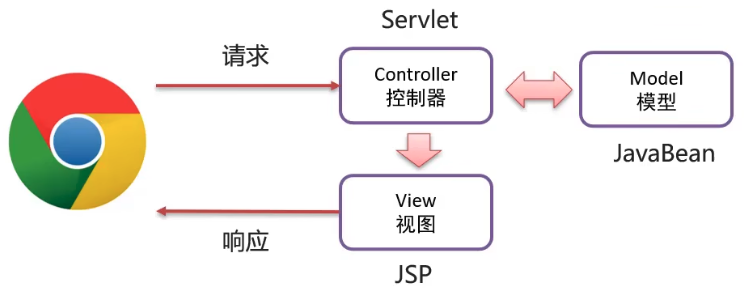
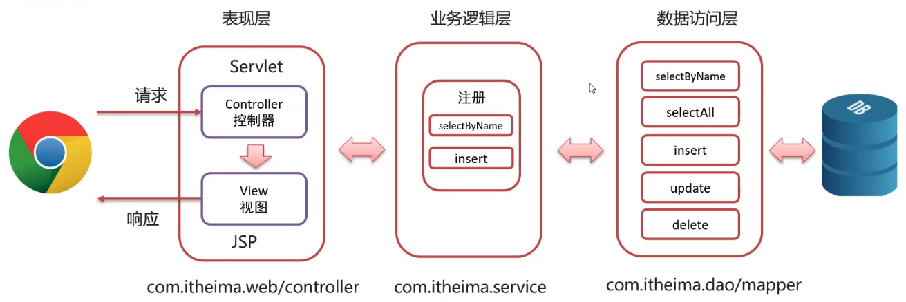
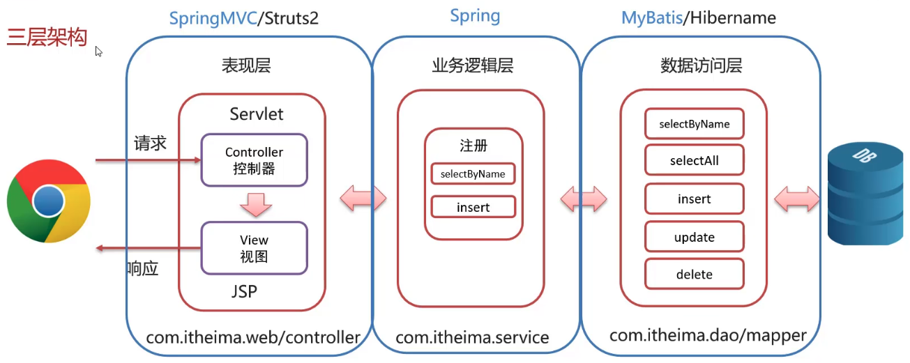
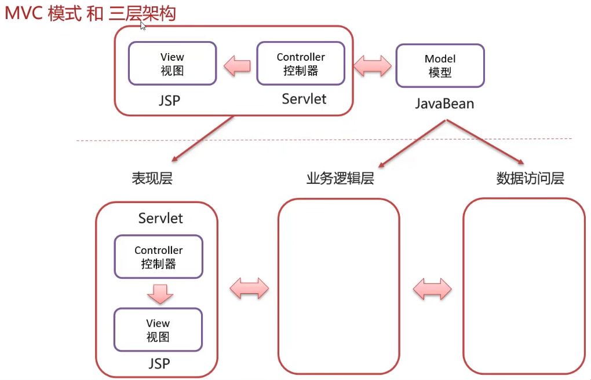

# MVC 模式和三层架构

## MVC 模式

MVC 是一种分层开发的模式，其中
- M：Model，业务模型，处理业务
- V：View，视图，界面展示
- C：Controller，控制器，处理请求，调用模型和视图

MVC 好处
- 职责单一，互不影响
- 有利于分工协作
- 有利于组件重用

三层架构
- 数据访问层（DAO 或者数据持久层）：对数据库的CRUD基本操作
- 业务逻辑层：对业务逻辑进行封装，组合数据访问层层中基本功能，形成复杂的业务逻辑功能
- 表现层：接收请求，封装数据，调用业务逻辑层，响应数据

三大架构

